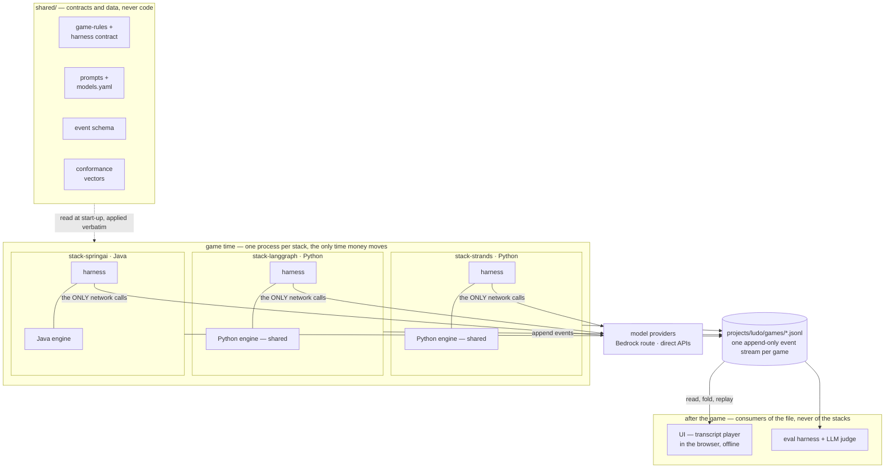

# Architecture Overview

> Unfamiliar term? The [glossary](../glossary.md) defines everything this repo uses as shorthand — *parity*, *stack*, *event stream*, *harness*, *conformance vector*, and the rest.

## The core problem

We build every project three times — Strands, LangChain/LangGraph, Spring AI — and compare the results. That comparison is worthless unless the three implementations differ **only** in the agent framework.

Left alone, they won't. Three teams (or three sessions) writing a Ludo engine will produce three subtly different games, and every downstream difference becomes uninterpretable. So the architecture's main job is **controlling the variables**.

## The parity model

Split every project into layers, and decide deliberately which layer is allowed to vary.

| Layer | Varies per stack? | Why |
|---|---|---|
| **Game engine** — rules, board state, dice, legal moves, win detection | **No** | Deterministic, no LLM involved. Any variation here is pure noise. |
| **Prompts and model config** — what agents are told, which models play | **No** | Sent verbatim from [`shared/`](../../shared/prompts/README.md). A stack that edited a prompt would be measuring its own wording. |
| **Harness contract** — the *behaviour* every stack must produce: phases, budgets, failure rules, events out | **No** | The parity surface. Written as [a spec](../projects/ludo/harness-contract.md), not code. |
| **Agent layer** — how the framework meets that contract: LLM calls, memory, context management | **Yes** ← | **This is the thing under study.** |
| **Orchestration** — turn loop, swarm coordination, negotiation mechanics | **Yes** ← | Also under study; frameworks differ most here. |
| **Event stream** — what the system emits as it runs | **No** | Shared schema. Enables one UI + one eval harness for all three. |
| **Evaluation** — scoring, LLM-as-judge | **No** | Judging three stacks with three judges proves nothing. |
| **UI** | **No** | One implementation, consumes the shared event stream. |

Two rows carry the whole design:

### Keystone 1 — the shared harness contract

Agents never touch game state directly — and they never even *ask* for things. **The engine drives**: once per turn it calls each stack's harness at three fixed points, and the [harness contract](../projects/ludo/harness-contract.md) specifies what must observably happen at each:

```
negotiate   the floor-passing table conversation (ADR-0009)
choose      pick from moves the ENGINE already computed and validated;
            one retry after a rejection, then the turn is forfeit
reflect     one memory-write opportunity, after the turn resolves
```

An agent is never asked "is this legal?" — it is handed a list that already is, and anything else it returns is rejected, not corrected. **An agent cannot cheat by producing bad output** — it can only lose a turn ([ADR-0004](../decisions/adr-0004-structural-guardrails.md)), which is what makes lenient guardrails safe.

Note what the contract deliberately does **not** fix: the mechanism. Whether a stack meets it with tool calls, handoffs, or parsed JSON is framework territory ([ADR-0008](../decisions/adr-0008-framework-native-harness.md)) — that is where the comparison lives. An earlier version of this page showed a fixed list of callable tools (`make_move(...)`, `roll_dice()`); that design was superseded by the contract-plus-native-mechanism split, and the correction is left visible because it *is* the lesson: pin behaviour, free the machinery.

### Keystone 2 — the shared event stream

Every implementation emits the same append-only event stream: dice rolls, moves, captures, messages sent, agent reasoning, token counts, latencies, costs, guardrail triggers, memory writes, context compactions.

This single decision buys a lot:

- **One UI** works against all three stacks, and against recorded games with no backend running.
- **One eval harness** scores all three identically.
- **A game becomes a file.** Reproducible, diffable, shareable, replayable — you can review a match without re-spending tokens.
- **Comparison is mechanical**, not vibes: diff the streams.

The schema lives in `shared/schemas/` and is versioned. Adding an event type is cheap; changing one is a breaking change that all three stacks must follow together.

## System shape — where the data actually flows

**Before you scroll:** the UI replays a game played by the Java stack. What connects the browser to that stack — REST? A WebSocket? Predict it, then check.

Nothing does. **A file connects them.** If you come from Spring, the arrow you're looking for — the controller the frontend calls — deliberately does not exist, and seeing why is most of this architecture:



Reading it:

- **The file is the API.** A game *becomes* `games/<name>.jsonl` — appended during play, read forever after. The UI's entire input is that file; so is the eval harness's. Diff two games, share one in a gist, replay a match without re-spending a token ([ADR-0003](../decisions/adr-0003-shared-event-stream.md)).
- **The missing frontend arrow is a feature, not a gap.** The UI cannot query a harness, so anything it shows must be derivable from events — which turns the UI into a *test* of the event schema. That test has already caught its first prey: when the Spring AI transcript landed, the UI suite grew by four tests with **zero** source changes ([ADR-0007](../decisions/adr-0007-ui-alongside-first-stack.md)).
- **Inside a stack, everything is in-process.** The engine calls the harness (`negotiate` / `choose` / `reflect`) through an ordinary language-level seam — a `Protocol` in Python, an `interface` in Java. No service boundary, no queue: one game is one process ([class-design §§9–10](../projects/ludo/class-design.md#9-the-harness-layer-the-same-turn-on-strands) draw both harnesses at method level).
- **Only harnesses touch the network.** Engines are deterministic and SDK-free; the UI runs offline against committed fixtures; the judge does spend tokens, but it reads only the file — never a stack.
- **Three clocks.** *Check time* (CI: conformance vectors, schema and prompt invariants, doc checks) costs nothing. *Game time* is where tokens are spent. *Replay time* is free forever — the judge is the one later consumer that pays, and even it reads only the file. Free replay is what makes a public repo of recorded games viable at all.

Note there are **two** engines, not four — the Python one appears twice above because both Python stacks embed the *same package* in separate venvs. See below.

## Why two engines, not three

The Ludo engine is ordinary deterministic code. Writing it three times triples the surface area for rule drift while teaching nothing about LLMs.

So: **one engine per language.** Strands and LangGraph share the Python engine — meaning the *only* difference between those two implementations is the agent framework itself. That's a genuinely controlled experiment. Spring AI gets a Java engine, kept honest by a shared set of **conformance vectors** (JSON files: given this seed and this move sequence, here is the exact resulting state) that both engines must reproduce.

Recorded as [ADR-0002](../decisions/adr-0002-engine-per-language.md).

## Model access is configuration, not code

[`shared/models.yaml`](../../shared/models.yaml) maps numbered seats to concrete providers. All three stacks read it:

```yaml
seats:
  - { seat: 1, access: bedrock, provider: anthropic, model: … }  # ─┐ same model,
  - { seat: 3, access: direct,  provider: anthropic, model: … }  # ─┘ two routes  ← the control
  - { seat: 2, access: bedrock, provider: amazon,   model: … }
  - { seat: 4, access: direct,  provider: deepseek, model: … }
```

Swapping a player from Bedrock to a direct API is a config edit, not a code change — which is what makes the **Bedrock vs. direct API** comparison (auth, latency, cost accounting, guardrail availability, observability hooks) cleanly measurable.

**Seats, not colours.** Which colour a seat plays rotates between games and is recorded per game in `game_started` ([ADR-0006](../decisions/adr-0006-seat-rotation.md)). Nothing may assume red is the same model it was last transcript.

One model deliberately occupies **both** access routes. Holding the model constant is what makes route differences attributable to the route rather than to the model — see [ADR-0005](../decisions/adr-0005-model-access-control.md).

**Two profiles**, `dev` and `headline`, differing in model tier and budget. A cheap shakedown run and a real result are then impossible to confuse, because the profile name is recorded in the transcript. All three stacks always run the same profile — the profile varies per *experiment*, never per stack.

Inference settings are pinned explicitly rather than left to the frameworks — an unpinned sampling parameter is a parity break that never announces itself. They are pinned **per provider**, because the families genuinely differ: the Claude 5 models reject `temperature`/`top_p` and use an `effort` level instead, while Nova and DeepSeek do the opposite. That asymmetry is a recorded [capability-matrix finding](stack-comparison.md#finding-inference-settings-are-not-uniformly-pinnable), not a hole in the control — seats 1 and 3 remain identically configured, which is what ADR-0005 actually rests on.

Families are settled and the Anthropic pair is pinned; **Nova, DeepSeek, and judge IDs are still [open](../open-questions.md)**.

## Cross-cutting concerns

**Observability.** Structured events are the substrate; OpenTelemetry spans wrap agent turns and LLM calls. Every stack emits the same span names and attributes so traces are comparable. Where a framework's native instrumentation doesn't reach, we adapt — and record the gap.

**Cost & tokens.** Every LLM call records input/output/cached tokens and computed cost. Per-agent and per-game budgets are enforceable, with a hard ceiling so a runaway negotiation can't drain an account.

**Caching.** The rules and system prompt are large and stable; the game state is small and changing. That's the ideal prompt-caching shape, and cache hit rates go into the event stream as a first-class metric.

**Guardrails.** Scoped to the *game boundary*, not to strategy. In-fiction deception is allowed and encouraged; out-of-fiction manipulation (prompt injection at other agents or the harness, attempts to forge state, abuse) is blocked. Detail in [agent design](../projects/ludo/agent-design.md).

**Harness engineering.** Agent memory and context compaction are implemented with each framework's *own* primitives ([ADR-0008](../decisions/adr-0008-framework-native-harness.md)) — how much each framework gives you free is a stated question of the project — but they are never allowed to be invisible: the [harness contract](../projects/ludo/harness-contract.md) makes their events mandatory, and those events surface directly in the UI.

## Local first, cloud when it earns it

Everything runs locally against real model APIs before any of it is deployed. AWS services enter when a project actually needs them (Lambda + API Gateway for hosted play, AgentCore for managed agent runtime, SageMaker for the fine-tuning topics) rather than as an upfront requirement. See the [topic roadmap](../topics/roadmap.md).

## Related

- [Repository layout](repository-layout.md) — where this lands on disk
- [Environment strategy](environment-strategy.md) — keeping two Python stacks and a JVM from fighting
- [Stack capability matrix](stack-comparison.md) — the running record of framework gaps
