# LUDO Engine — Low-Level Class Design

The object graph as actually built, at method granularity: who owns what, who calls what, which relationships are inheritance versus something looser, and [which design patterns are genuinely in play](#7-design-patterns-from-the-problem-up).

**New to design patterns?** [Section 7](#7-design-patterns-from-the-problem-up) is written for you — each pattern starts from a problem this engine actually hit, shows the code you'd write first, shows what breaks, and only then names the thing.

**This is a living document.** It covers the engines only. The agent stacks attach at a single dashed arrow and have not been drawn yet. It grows as the agent stacks, UI, and eval harness arrive — see [What comes next](#what-comes-next).

Companion docs: [engine-design.md](engine-design.md) explains *why* these shapes were chosen; this one shows *how they connect*. For Python syntax itself, see [learning/python](../../../learning/python/).

---

## 1. The object graph

Methods only — field types are in the [reference table](#5-class-reference). Private helpers prefixed `_`.

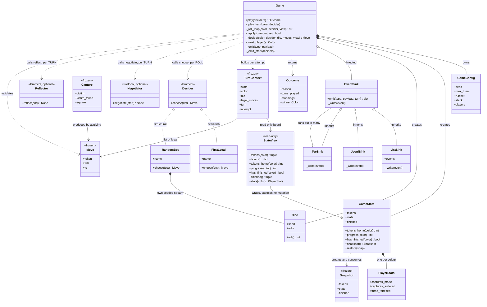

### Reading the arrows

| Arrow | Means | Where it's used here |
|---|---|---|
| `<\|--` | **Inheritance** | Only `EventSink` → its three subclasses. The single hierarchy in the engine. |
| `<\|..` | **Realization** | `FirstLegal`/`RandomBot` satisfy `Decider`. Dotted because in Python this is *structural* — neither class names `Decider` anywhere. |
| `*--` | **Composition** | Owner creates it and controls its lifetime. `Game` creates its own `GameState` and `Dice`. |
| `o--` | **Aggregation** | Holds something it did not create. `Game` receives its `EventSink` from outside. |
| `..>` | **Dependency** | Uses transiently — constructs, returns, or calls, without holding. |

The two dotted-inheritance arrows are the design's centre of gravity. `FirstLegal` contains no reference to `Decider`; it qualifies purely by having a `choose` method of the right shape. That's what lets an agent in a completely separate package plug in without importing the engine.

---

## 2. The two extension points, zoomed in

Everything above is fixed machinery except these. They're where other code attaches.

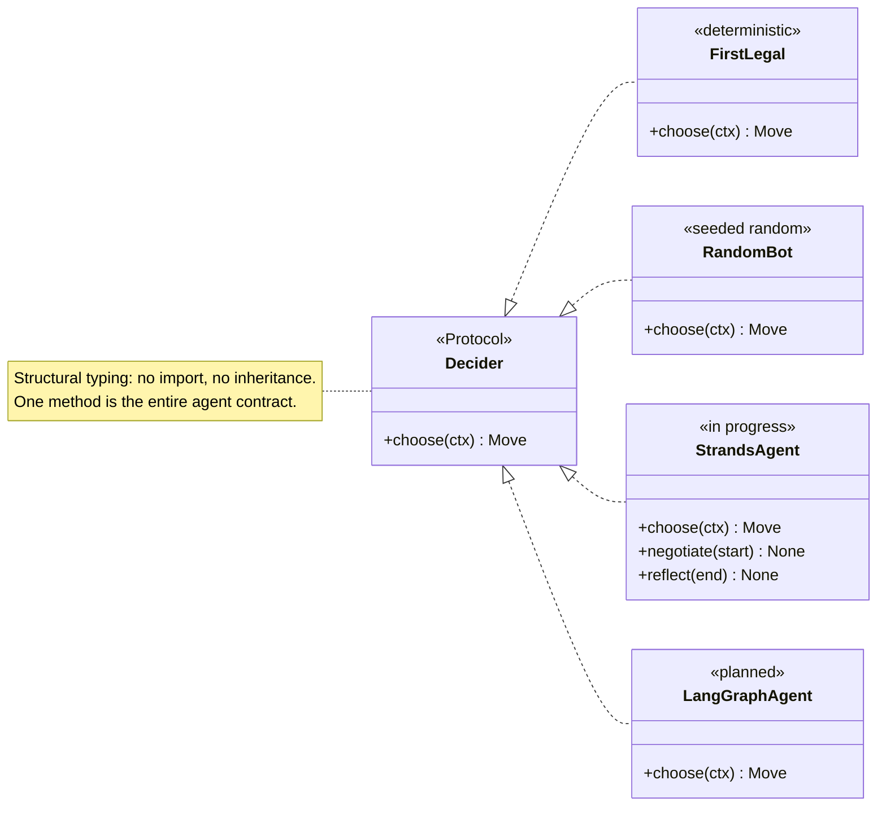

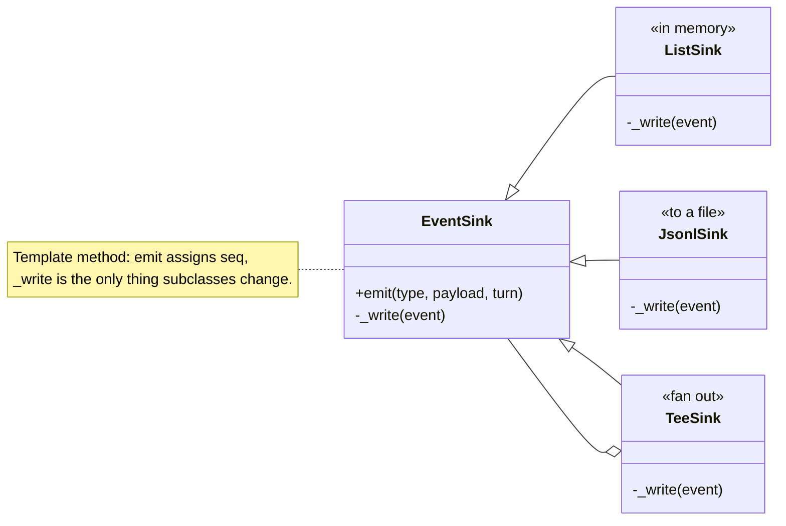

`TeeSink` both **inherits from** `EventSink` and **holds** several — so `TeeSink(ListSink(), JsonlSink(fh))` writes to memory and disk under one shared sequence counter. It deliberately calls each child's `_write`, not `emit`, so children never renumber.

---

## 3. One turn, as calls

The interaction the class diagram can't show. This is `Game._play_turn` for a single turn that captures a token and earns an extra roll.

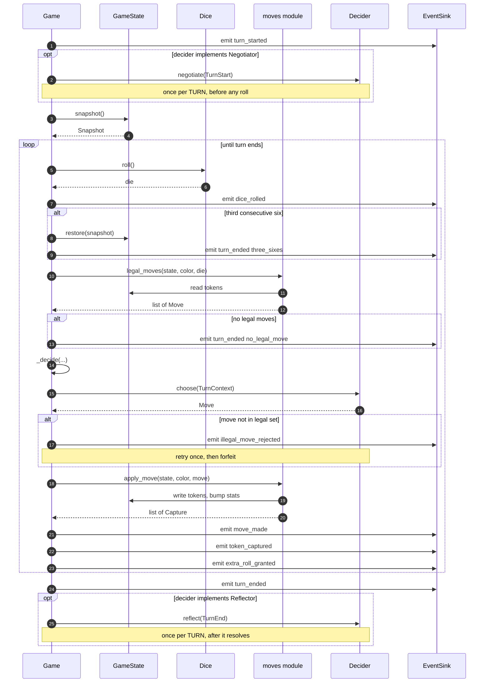

Three things this makes obvious that prose does not:

- **`Decider.choose` is the only inbound arrow that changes the game.** The two optional hooks sit *outside* the roll loop and return nothing — they exist so a harness can talk and remember at the right moments, and everything they produce reaches the world as events rather than as state.
- **The loop is where per-roll and per-turn diverge.** `choose` is inside it, `negotiate` and `reflect` are outside. A six or a capture re-enters the loop; if negotiation were inside, an agent on a hot streak would get a free multiplier on influence and cost.
- **The agent never touches `GameState`.** Only `moves` and `Game` write to it; the decider receives a read-only [`StateView`](engine-design.md#one-honest-limit-on-the-guardrail). That's the structural guardrail of [ADR-0004](../../decisions/adr-0004-structural-guardrails.md).

---

## 4. Who calls what

Method-level, engine only.

| Caller | Calls | For |
|---|---|---|
| `Game.play` | `Game._emit_start`, `_next_player`, `_play_turn` · `standings()` · `EventSink.emit` · `Outcome()` | the outer loop |
| `Game._play_turn` | `StateView()` · **`Negotiator.negotiate`** · `Game._roll_loop` · **`Reflector.reflect`** · `EventSink.emit` | one turn, with the optional hooks around the roll loop |
| `Game._roll_loop` | `Dice.roll` · `GameState.snapshot`/`restore`/`has_finished` · `legal_moves()` · `Game._decide`/`_apply` · `EventSink.emit` | roll, decide, resolve — repeating on a six or capture. Returns the end reason so the turn has one exit and `reflect` can't be skipped |
| `Game._decide` | `TurnContext()` · **`Decider.choose`** · `EventSink.emit` | ask the agent, validate |
| `Game._apply` | `apply_move()` · `to_square()` · `EventSink.emit` | move and report |
| `Game._next_player` | `GameState.has_finished` | rotate, skipping finishers |
| `GameState.snapshot` / `restore` | `Snapshot()`, `PlayerStats()` | copy in, copy out |
| `moves.legal_moves` | `to_square()`, `_can_land`, `_path_clear` | rule check |
| `moves.apply_move` | `to_square()`, `is_safe()` | move, capture, count |
| `RandomBot.choose` | `Dice.roll` | its own seeded stream |
| `TeeSink._write` | each child's `_write` | fan out, shared seq |
| `conformance.run_vector` | `Game.play`, `ListSink`, `digest()` | one deterministic game |

Note `board` is called by everyone and calls nobody — it's leaf-level pure functions.

---

## 5. Class reference

| Class | Kind | Module | Mutable | Purpose |
|---|---|---|---|---|
| `Game` | plain class | `game.py` | yes | the turn loop |
| `GameConfig` | dataclass | `game.py` | yes | seed, cap, player metadata |
| `Outcome` | dataclass | `game.py` | yes | result + `winner` property |
| `GameState` | dataclass | `state.py` | yes | tokens, stats, finish order |
| `PlayerStats` | dataclass | `state.py` | yes | three counters per colour |
| `Snapshot` | dataclass | `state.py` | frozen | turn-start copy for rollback |
| `Move` | dataclass | `moves.py` | frozen | must be hashable for `set` |
| `Capture` | dataclass | `moves.py` | frozen | what a move knocked out |
| `Dice` | plain class | `dice.py` | yes | portable seeded PRNG |
| `TurnStart` | dataclass | `deciders.py` | frozen | handed to `negotiate`, before the first roll |
| `TurnContext` | dataclass | `deciders.py` | frozen | everything an agent may see when choosing |
| `TurnEnd` | dataclass | `deciders.py` | frozen | handed to `reflect`: end reason + the turn's engine events |
| `StateView` | plain class | `deciders.py` | read-only | the board, inspectable but not writable |
| `Decider` | **Protocol** | `deciders.py` | — | the agent contract — `choose`, required |
| `Negotiator` | **Protocol** | `deciders.py` | — | optional `negotiate` hook, once per turn |
| `Reflector` | **Protocol** | `deciders.py` | — | optional `reflect` hook, once per turn |
| `FirstLegal` | plain class | `deciders.py` | no | deterministic, for vectors |
| `RandomBot` | plain class | `deciders.py` | yes | seeded random, for benchmarks |
| `EventSink` | base class | `events.py` | yes | sequence numbering |
| `ListSink` / `JsonlSink` / `TeeSink` | subclasses | `events.py` | yes | memory / file / fan-out |

---

## 6. Module layering

Dependencies point one way only.

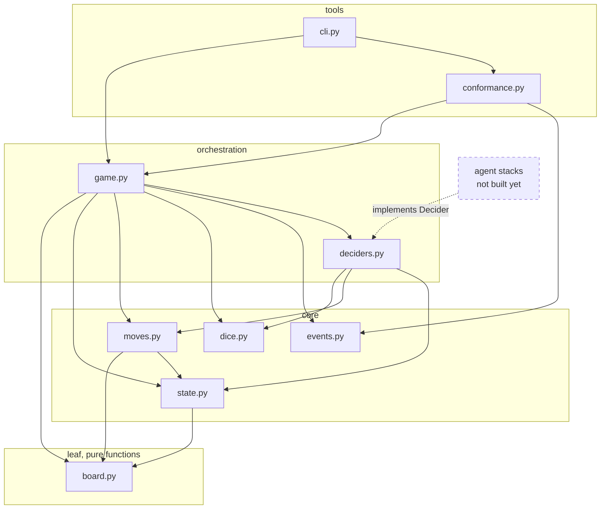

No arrow ever points back up, and nothing in the engine points at an agent framework. The only inbound edge from outside is dashed: a stack implements `Decider`. That is the whole integration surface.

---

## 7. Design patterns, from the problem up

### First — what *is* a design pattern?

A design pattern is **a named solution to a problem that keeps coming back**. Not a library, not a rule you must follow — a description of a shape that has repeatedly turned out to work.

The idea didn't start in software. In 1977 the architect **Christopher Alexander** published *A Pattern Language*, cataloguing recurring solutions in building design: "light on two sides of every room", "a six-foot balcony". His argument was that good design is rarely invention — it's recognising a situation you've seen before and remembering what worked.

In 1994 four authors — universally called the **Gang of Four** — did the same for object-oriented software and catalogued 23 patterns. Strategy, Template Method, Memento and Composite below all come from that book. **Value Object** is later, from Eric Evans's *Domain-Driven Design* (2003). **Ports and Adapters** is Alistair Cockburn's (2005).

Two things worth knowing before you read on.

**The names are most of the value.** Saying "make that a Strategy" replaces three paragraphs of explanation between two people who both know the word. The code shapes themselves are things a good programmer often arrives at anyway — the shared vocabulary is what you're really gaining.

**Patterns are descriptions, not prescriptions.** The Gang of Four catalogued what already worked; they didn't hand out a checklist. Reaching for a pattern *because it's in the book* is one of the reliable ways to make a codebase unreadable. Everything below is here because a concrete problem pushed us into it — and [section 8](#8-patterns-deliberately-not-used) lists the ones we deliberately didn't use, which is just as instructive.

### How each one below is laid out

The usual way patterns get taught is backwards: here's a name, here's a definition, here's a diagram. But a pattern is an **answer**, and an answer means nothing until you've felt the question. So each one starts with a problem this engine actually hit, shows the code you'd reasonably write first, shows what breaks — and only then names the thing, explains where that odd name comes from, and gives you a rule of thumb for spotting the situation again.

Already know the patterns? Skip to the [recap](#79-recap).

---

### 7.1 Four players, four different brains → **Strategy**

**The problem.** `Game` has to ask each player "what's your move?" But the players are wildly different things. Two exist today: `RandomBot` (picks at random, for benchmarking) and `FirstLegal` (always takes the first option, so conformance vectors stay reproducible). Three more are coming, each an LLM agent on a different framework — one of them in *Java*.

How does the turn loop ask the question without knowing who it's asking?

**What you'd write first.** The honest first attempt is a branch:

```python
# NOT what the engine does
if player_type == "random":
    move = random.choice(moves)
elif player_type == "first_legal":
    move = moves[0]
elif player_type == "strands":
    prompt = build_prompt(state, moves)
    reply = bedrock.invoke(prompt)        # <-- the engine now needs boto3
    move = parse(reply)
elif player_type == "langgraph":
    ...
```

Perfectly reasonable code. It also quietly destroys the project.

**What breaks.**

- The engine now imports an LLM SDK — [the one rule it must never break](../../architecture/repository-layout.md).
- Every new agent means editing `game.py`, the file whose correctness the conformance vectors depend on.
- Tests can't run without mocking a model provider.
- Adding a fourth agent means a fifth branch, forever.

**The fix.** Turn the question into a one-method contract, and let the caller supply the answerer:

```python
class Decider(Protocol):
    def choose(self, ctx: TurnContext) -> Move: ...
```

```python
move = decider.choose(ctx)      # game.py — every player, one line
```

Now `Game` *cannot* know what it's talking to. That inability is the feature.

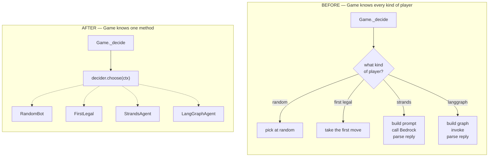

**Where the name comes from.** A *strategy* is a plan of action. The insight the name captures: make the plan a **separate, swappable object** rather than logic baked into whoever executes it. The general doesn't change; the battle plan does.

**The everyday version.** A power drill with swappable bits. The drill's job — spin — never changes. What you attach decides whether you're drilling masonry or driving a screw. The drill needs to know nothing about the bit beyond "it fits the chuck." `choose(ctx) -> Move` is our chuck.

**Reach for it when** you have an `if`/`elif` branching on a *kind of thing*, where every branch does the same job a different way. That's a Strategy waiting to be extracted.

**Don't when** there's only ever going to be one implementation. An interface with a single implementer is ceremony, not design.

---

### 7.2 Every event needs a number, but events go to different places → **Template Method**

**The problem.** The [event schema](../../../shared/schemas/README.md) requires `seq` to start at 0 and never skip. But events go to different destinations: memory during tests, a `.jsonl` file when recording a game, sometimes both at once.

**What you'd write first.** Give each destination its own emit method:

```python
# NOT what the engine does
class ListSink:
    def emit(self, type_, payload, turn=0):
        self.events.append({"seq": self._seq, "turn": turn, ...})
        self._seq += 1

class JsonlSink:
    def emit(self, type_, payload, turn=0):
        self._stream.write(json.dumps({"seq": self._seq, ...}) + "\n")
        self._seq += 1
```

**What breaks.** The numbering logic is now copy-pasted, and copy-pasted logic drifts. Someone increments before building the envelope, or forgets `turn`, or resets the counter on flush. The transcript then fails schema validation — and it fails *silently*, staying wrong until the UI tries to replay it and hits a gap.

**The fix.** Write the algorithm once and leave exactly one hole:

```python
class EventSink:
    def emit(self, type_, payload, turn=0):
        event = {"seq": self._seq, "turn": turn, "type": type_, "payload": payload}
        self._seq += 1              # the invariant: fixed, shared, unbypassable
        self._write(event)          # the hole: the only thing that varies

    def _write(self, event):
        raise NotImplementedError
```

A subclass can't break `seq`, because it never gets to touch it.

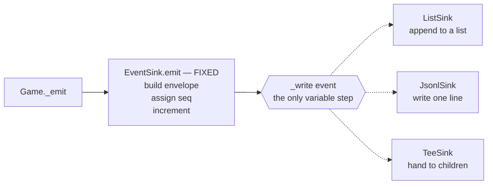

**Where the name comes from.** "Template" in the everyday sense — a form with blanks. The base class writes the form; subclasses fill in the blanks. "Method" because the template *is* a method (`emit`), not a class or a file.

**The everyday version.** A recipe that reads: *preheat oven, season **your choice of protein**, roast 40 minutes, rest 10 minutes.* Four steps fixed, one is yours. Crucially, nobody can accidentally skip the resting step — the recipe owns it. That's exactly what stops a subclass breaking `seq`.

**Reach for it when** two or more methods are ~90% identical and differ in one step. Hoist the sameness into a base class, leave a hole.

**Don't when** the shared skeleton is trivial. If two lines are common and ten differ, inheritance costs more than the duplication did.

#### Easily confused: Strategy vs Template Method

These trip up almost everyone, because both are "some behaviour varies."

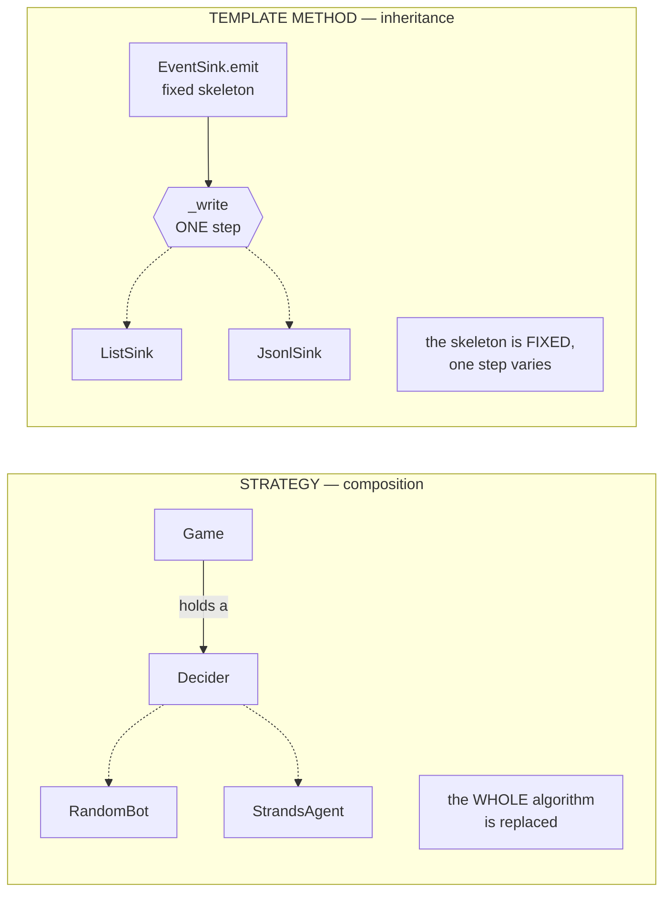

**The mnemonic:** Template Method uses **inheritance** and varies **one step inside a fixed algorithm**. Strategy uses **composition** and varies **the whole algorithm**. If you find yourself asking which you need, ask instead: *how much is allowed to change?*

---

### 7.3 Three sixes cancel the turn — including the capture → **Memento**

**The problem.** [The rules](game-rules.md) say three consecutive sixes forfeit the turn, and *everything done during it is cancelled*. By the time that third six lands, the player may have moved two tokens and captured an opponent. All of it must be undone.

**What you'd write first.** Two obvious approaches:

```python
# Attempt A — record what changed, reverse it
undo_log.append(("move", token, old_position))
undo_log.append(("capture", "green", 2, 44))
for action in reversed(undo_log):
    reverse(action)
```

```python
# Attempt B — let Game reset the fields directly
game.state.tokens[color] = saved_tokens
game.state.stats[color].captures_made = saved_captures
```

**What breaks.**

*Attempt A:* every rule now needs a matching un-rule, and the two must stay in sync forever. Add blocks, and you need un-block. Miss one and the board is subtly wrong, with no exception raised.

*Attempt B:* `Game` now knows the internal shape of `GameState`. Add a field to `GameState` and rollback silently stops restoring it. Nothing fails — the board is just quietly corrupt. That's the worst kind of bug, and [example 04](../../../learning/python/examples/04_mutability_and_copying.py) reproduces exactly this failure.

**The fix.** Let `GameState` package its own state into an opaque object, and let `Game` hold it *without ever looking inside*:

```python
before = self.state.snapshot()      # Game receives a sealed box
...
self.state.restore(before)          # and hands it back, unopened
```

`Game` never reads `before`. It couldn't corrupt the board through it if it tried. And when `GameState` grows a new field, only `snapshot`/`restore` change — the one place that already knows about it.

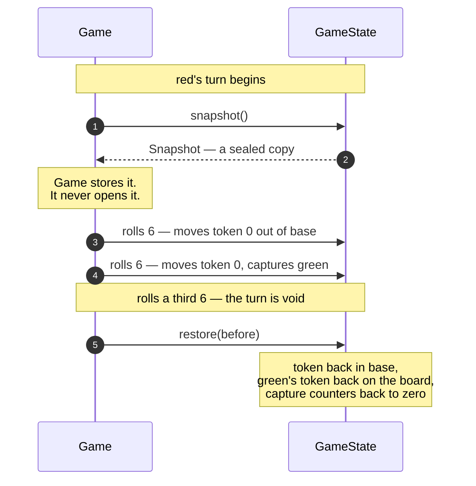

**Where the name comes from.** A *memento* is a keepsake — a ticket stub or a pebble you keep to remember a day by. You don't take the day apart and store its pieces; you keep one small token that can bring the whole thing back. That is precisely what `Snapshot` is, and why the pattern isn't called "Undo" or "Backup": the emphasis is on the **opaque token**, not the restoring.

**The everyday version.** A save point in a video game. You have no idea how the game serialises its world, and you don't need to — you have "the save", and you can load it. If the game later adds weather, your save still works, because the game owns the format.

**Reach for it when** you need to restore a previous state **and** the undo logic would otherwise leak into whoever is calling. The second half matters: if the caller can already see all the state legitimately, you may just need a copy.

**Don't when** you need fine-grained, step-by-step undo — that's *Command* with an `undo()` per action. Memento restores a whole moment, not one step. Ludo cancels the entire turn, so Memento fits; a text editor's Ctrl-Z does not.

**The trap.** The memento must be a genuine **copy**, not a reference to live state. Get that wrong and `restore()` appears to work while doing nothing. See [example 04](../../../learning/python/examples/04_mutability_and_copying.py).

---

### 7.4 Record to a file *and* keep events in memory → **Composite**

**The problem.** The CLI needs both at once: stream the transcript to disk *and* keep the events in memory to print a summary when the game ends.

**What you'd write first.** Let `Game` hold a list of sinks:

```python
# NOT what the engine does
def __init__(self, config, sinks: list[EventSink]):
    self.sinks = sinks
...
for sink in self.sinks:
    sink.emit(...)
```

**What breaks.** Two things, and the second is nastier.

*`Game` now has two shapes to handle.* Every caller has to know whether it's holding one sink or several:

```python
if isinstance(sink, list):
    for s in sink:
        s.emit(type_, payload, turn)
else:
    sink.emit(type_, payload, turn)
```

*The sequence numbers diverge.* Each sink owns its own `_seq` counter, so calling `emit` on three sinks produces three independent numberings. The file and the in-memory copy stop agreeing about what event #7 was — and the [schema](../../../shared/schemas/README.md) requires one contiguous sequence.

---

#### The fix, and the shape that makes it work

Build a sink that **is** a sink and **contains** sinks:

```python
class TeeSink(EventSink):              # IS-A: usable anywhere a sink is
    def __init__(self, *sinks):
        self._sinks = sinks            # HAS-A: holds other sinks

    def _write(self, event):
        for sink in self._sinks:
            sink._write(event)         # pass the FINISHED event down
```

Two facts, and it's the **combination** that makes the pattern:

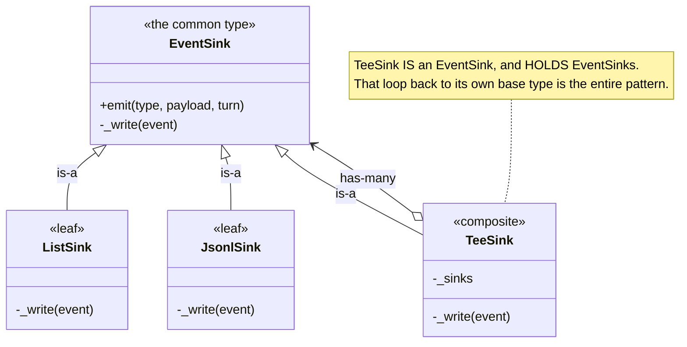

A class that is-a `X` *and* has-many `X` is an unusual shape, and it's worth pausing on — **that self-reference is Composite.** Everything else follows from it.

#### Why the loop buys you nesting for free

`TeeSink` accepts *any* `EventSink`. And `TeeSink` **is** an `EventSink`. So a `TeeSink` can hold a `TeeSink` — without anyone writing a line of code to allow it:

```python
sink = TeeSink(
    ListSink(),                                  # a leaf
    TeeSink(                                     # a composite INSIDE a composite
        JsonlSink(open("game.jsonl", "w")),
        JsonlSink(open("backup.jsonl", "w")),
    ),
)

game = Game(config, sink)      # Game's code does not change. At all.
```

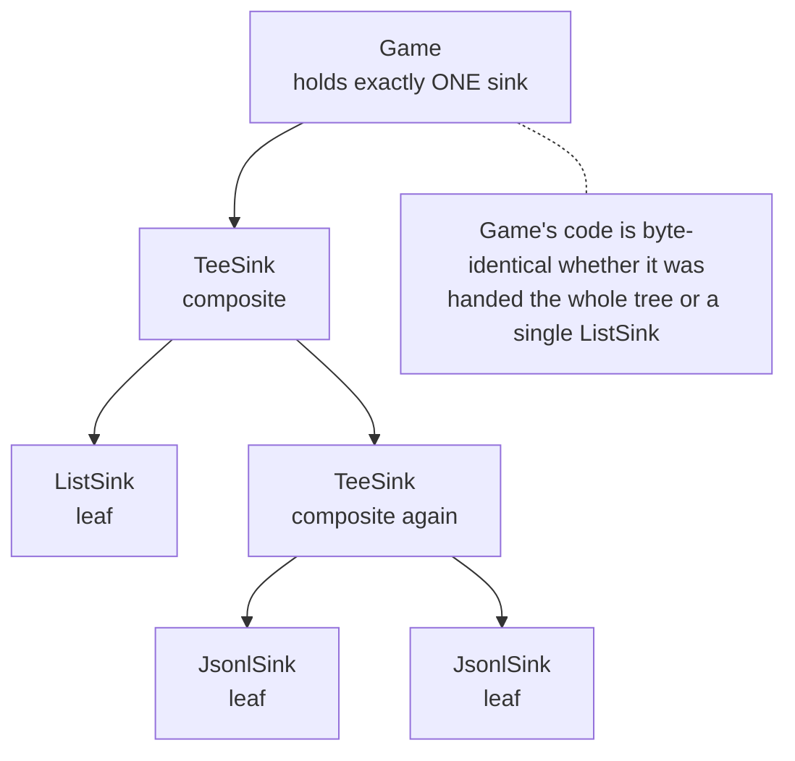

Depth is unlimited, and no code anywhere counts levels. Recursion falls out of the type structure rather than being programmed.

#### You already know this shape

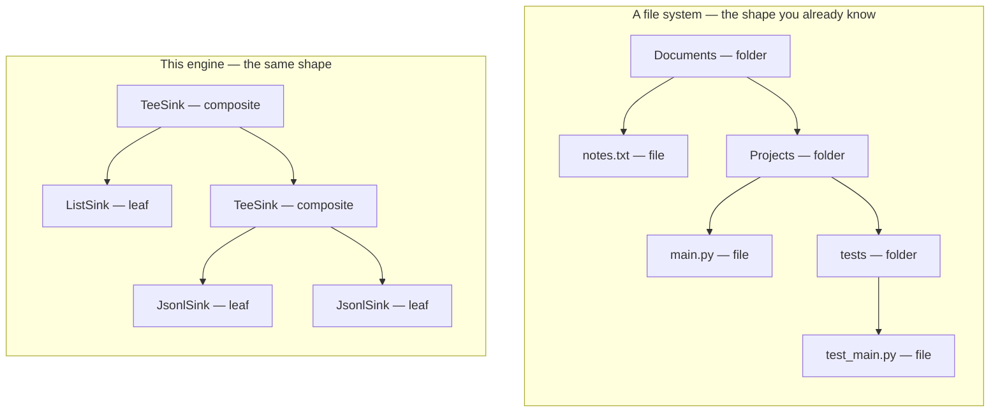

A folder **contains** files and folders, and a folder **is** a file-system entry. That's the same is-a/has-a loop. It's why you can copy, move, rename, zip, or delete a folder using exactly the same command as a single file — and why nobody had to write a special "copy a folder five levels deep" feature.

#### One call, the whole tree

`Game` calls `emit` **once**. It has no idea how far the event travels:

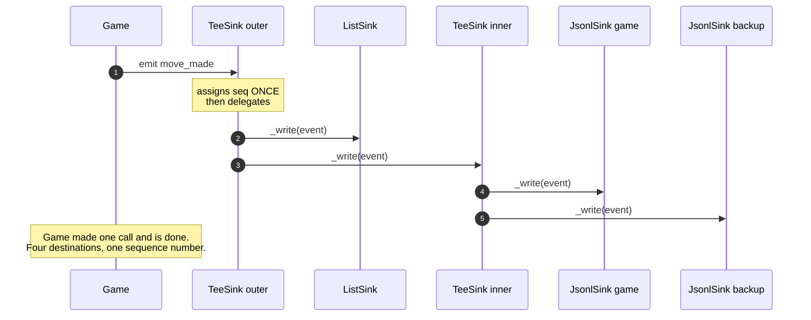

Note the detail that makes it correct: children receive `_write`, not `emit`. `emit` is where `seq` is assigned, so routing through it would let every child renumber independently — reintroducing exactly the bug the list version had.

---

**Where the name comes from.** "Composite" simply means *made up of parts*. The bit people miss is what the name is really asserting: the composite is **the same kind of thing as its parts**. A group of sinks isn't a new concept called "sink group" — it's just a sink. That sameness is what lets every caller stop caring.

**The everyday version.** A folder, as above. Also a moving box: a box of boxes is still just a box you pick up. And a company org chart — a department contains people and departments, and "headcount" works the same on either.

**Reach for it when** the caller keeps having to ask *"is this one, or many?"* — especially when you see `isinstance` checks or two parallel code paths that do the same thing at different arities. Make many *be* one.

**Don't when** parts and wholes genuinely behave differently. Forcing a uniform interface then produces methods that are meaningless for half the tree; the classic symptom is a leaf's `add_child()` that exists only to raise an exception.

### 7.5 "Is this one of the moves I allowed?" → **Value Object**

**The problem.** An agent hands back a `Move`. The engine must confirm it's one of the legal ones and reject it otherwise, because [an agent must not be able to cheat](../../decisions/adr-0004-structural-guardrails.md).

**What you'd write first.** The obvious check:

```python
if move in moves:      # with an ordinary class, `in` compares by IDENTITY
```

**What breaks.** The agent didn't return one of *our* objects — it built its own `Move(0, 3, 5)`. Same numbers, different object in memory. Identity comparison says "not legal", and **every legal move gets rejected**. Every turn forfeits. The game never progresses.

**The fix.** Make `Move` a *value*: immutable, with equality based on contents.

```python
@dataclass(frozen=True)
class Move:
    token: int
    frm: int
    to: int

Move(0, 3, 5) == Move(0, 3, 5)      # True — same value means same move
```

`frozen=True` does two jobs here. It makes equality-by-value safe, because the contents can't change after comparison. And it makes `Move` **hashable**, which unlocks the faster, clearer check the engine actually uses:

```python
allowed = set(moves)
if move in allowed: ...
```

**Where the name comes from.** From Domain-Driven Design, where things divide into **values** and **entities**. A value is defined entirely by *what it is*; an entity by *which one it is*. The name is doing real work — it's telling you identity is irrelevant.

**The everyday version.** A £10 note is a value: any £10 note is as good as any other, and you'd never demand *your specific* note back from a shopkeeper. Your passport is an entity: a perfect copy with identical details is emphatically **not** the same passport.

In this engine, `Move` and `Snapshot` are £10 notes. `Game` and `GameState` are passports — two `GameState`s holding identical tokens are still two different games.

**Reach for it when** you can answer "no" to: *if I swapped this for an identical-looking one, would anyone care?*

**Don't when** identity genuinely matters, or the object is large and copied constantly — immutability means every change allocates a new one.

---

### 7.6 "The engine must never import an LLM SDK" → **Ports and Adapters**

**The problem.** That rule is easy to state and easy to break by accident — one convenient import during a late-night debugging session and it's gone. How do you make it *structural* instead of a note in a README?

**The fix.** Notice the engine only ever needs two things from the outside world:

1. Someone to answer **"what's your move?"**
2. Somewhere to put **"here's what happened"**

Give each one an abstraction the core calls out through — a **port** — and let anything at all implement it — an **adapter**. The core's import list is then closed by construction.


**Reading it.** Adapters on the **left** are *driving* — they call into the engine. Adapters on the **right** are *driven* — the engine calls out to them. The distinction is just direction of control.

**Where the name comes from.** The metaphor is a physical device. A **port** is a socket of a defined shape that the device owns; an **adapter** is whatever plugs into it. You'll also see this called **Hexagonal Architecture** — Cockburn drew a hexagon purely so he could show several different ports around one core without implying a top-to-bottom stack. **The number six means nothing.** He later said he wished he'd led with "ports and adapters", because people kept asking why six.

**The everyday version.** Your laptop's USB-C port. The laptop defines the socket's shape and the protocol. It has no idea whether you'll plug in a monitor, a drive, or a charger — and it doesn't need to. Adding a new kind of peripheral never requires opening the laptop.

**Reach for it when** you have a rule of the form "X must never depend on Y." Turn the dependency into a port that X owns, and the rule stops being aspirational and starts being structural.

**Don't when** the program is small and each port will only ever have one adapter. Then it's indirection with nothing behind it.

**Why it matters here.** Two ports is the *entire* outside surface of the engine. That single fact is why the engine has no LLM dependency and can't acquire one by accident; why the UI and eval harness consume recorded games without importing a single engine class; and why the Java engine can be a straight port, with nothing framework-specific to translate.

---

### 7.7 The principles underneath

The six patterns above aren't six unrelated inventions. They're applications of a smaller set of ideas, usually taught as **SOLID**. Checked honestly against this engine:

| Principle | Plain English | Here |
|---|---|---|
| **S**ingle Responsibility | one reason to change | ✅ `board` geometry · `moves` rules · `dice` randomness · `events` output · `game` sequencing |
| **O**pen/Closed | extend without editing | ✅ New sinks and new agents need zero edits to `Game` |
| **L**iskov Substitution | any subtype works where the type is expected | ✅ Any `EventSink` for any other; same for `Decider` |
| **I**nterface Segregation | small interfaces beat big ones | ✅ `Decider` has exactly one method |
| **D**ependency Inversion | depend on abstractions, not concretions | ✅ `Game` depends on `Decider`, never on `RandomBot` |

**The thing worth actually remembering:** Strategy, Template Method and Ports & Adapters are all the *same two principles* — Open/Closed and Dependency Inversion — applied at different scales. One method, one class, one whole subsystem. If you internalise "depend on the shape, not the thing", you'll reinvent all three without needing the names.

**Where it's bent.** One genuine violation, left in deliberately:

```python
self.state.stats[color].turns_forfeited += 1        # game.py
```

Four levels of reaching through another object's internals. This breaks the **Law of Demeter** — "only talk to your immediate neighbours" — and "tell, don't ask" would put a `record_forfeit(color)` method on `GameState` instead. It's small enough to have been left alone, but if `Game` starts poking at more of `GameState`'s internals, that's the signal to fix it.

---

### 7.8 Rules of thumb, collected

If you remember nothing else:

| Pattern | The everyday version | Reach for it when… |
|---|---|---|
| **Strategy** | swappable drill bits | an `if`/`elif` branches on a *kind of thing*, each branch doing the same job differently |
| **Template Method** | a recipe with one step left to you | two methods are ~90% identical and differ in one step |
| **Memento** | a video-game save point | you need to restore a past state without the undo logic leaking to the caller |
| **Composite** | a folder holding files and folders | the caller keeps asking "is this one, or many?" |
| **Value Object** | a £10 note (vs a passport) | you'd never care *which* copy you got |
| **Ports & Adapters** | a USB-C socket | you have a rule "X must never depend on Y" and want it enforced, not hoped for |

And the one anti-rule: **if you can't name the problem that pushed you to it, you don't need the pattern.**

---

### 7.9 Recap

| Pattern | Source | Fit |
|---|---|---|
| **Strategy** | GoF behavioural | textbook |
| **Template Method** | GoF behavioural | textbook |
| **Memento** | GoF behavioural | textbook |
| **Composite** | GoF structural | textbook |
| **Value Object** | Evans, DDD | textbook |
| **Ports & Adapters** | Cockburn | textbook |
| **Dependency Injection** | — | textbook — `Game` is handed its sink rather than choosing one |
| **Facade** | GoF structural | *approximate* — `Game.play` is one call over the subsystem, but hides nothing you're forbidden to touch |
| **Event Sourcing** | Fowler | *approximate* — consumers rebuild from the log, but the engine keeps authoritative state too |

"Textbook" means all the pattern's roles are present and doing their job. "Approximate" means the shape rubs off but calling it the pattern would be a stretch. Most "patterns in our codebase" documents skip this distinction and over-claim — every dictionary becomes a Registry, every function a Factory.

## 8. Patterns deliberately not used

| Not used | Why |
|---|---|
| Abstract base classes (`ABC`) | `Protocol` gives the contract without forcing agents to import the engine |
| **Observer** | Sounds right for events, but there's no runtime subscribe/unsubscribe — one injected sink, composed statically by `TeeSink`. Registration would add lifecycle bugs for no gain. |
| **Factory / Abstract Factory** | Construction is trivial and explicit. A factory here would be indirection with nothing behind it. |
| **Singleton** | Everything hangs off a `Game` instance, so tests run independently and games can run in parallel. A singleton engine would make both impossible. |
| **Command** | `Move` is data, not an object with `execute()`/`undo()`. Undo is handled by Memento at turn granularity, which is what the rules actually need. |
| Multiple inheritance / mixins | Nothing needs it; it would obscure a codebase meant to be read |
| Class hierarchies for data | Records are flat dataclasses. Composition instead of an inheritance tree. |
| Exceptions for control flow | A failed turn returns `None`; only genuinely exceptional agent errors are caught |

One inheritance hierarchy, one protocol, everything else composition. That's the whole structural vocabulary — and the patterns above are descriptions of what emerged from the constraints, not a checklist that was applied up front.

---

## What comes next

This diagram will grow. Expected additions, roughly in build order:

| Component | Shape it will take |
|---|---|
| **Agent stacks** | 🚧 `stack-strands` under way. Each contributes a `Decider` implementation plus its own memory, negotiation, and context-compaction objects. They attach at the one dashed arrow above. |
| **`engine-java`** | ✅ **Built.** Mirrors this graph, with `Protocol` becoming an `interface` and frozen dataclasses becoming `record`s — see [engine-design.md](engine-design.md#porting-to-java). The optional hooks became `default` methods, and `Game` gained an `IntSupplier` seam Python did not need. |
| **Eval harness** | Reads transcripts only. Should appear with *no* arrow into the engine at all. |
| **UI** | Same — consumes the event stream, never the classes. |

If a future component needs an arrow *into* the engine that isn't `Decider`, that's worth challenging: it likely means something is bypassing the event stream.

---

## Viewing these diagrams

The blocks above are [Mermaid](https://mermaid.js.org/). They render automatically on GitHub, in VS Code with a Markdown preview extension, and in most JetBrains IDEs. In a plain terminal you'll see the source — which is still readable, and is why the tables duplicate the key relationships in text.

If one of them ever shows an error box instead of a picture, that's a bug worth reporting: every block on this page is parsed by mermaid itself in CI ([`scripts/check_mermaid.mjs`](../../../scripts/check_mermaid.mjs)), so a diagram that doesn't render should not have reached you.
