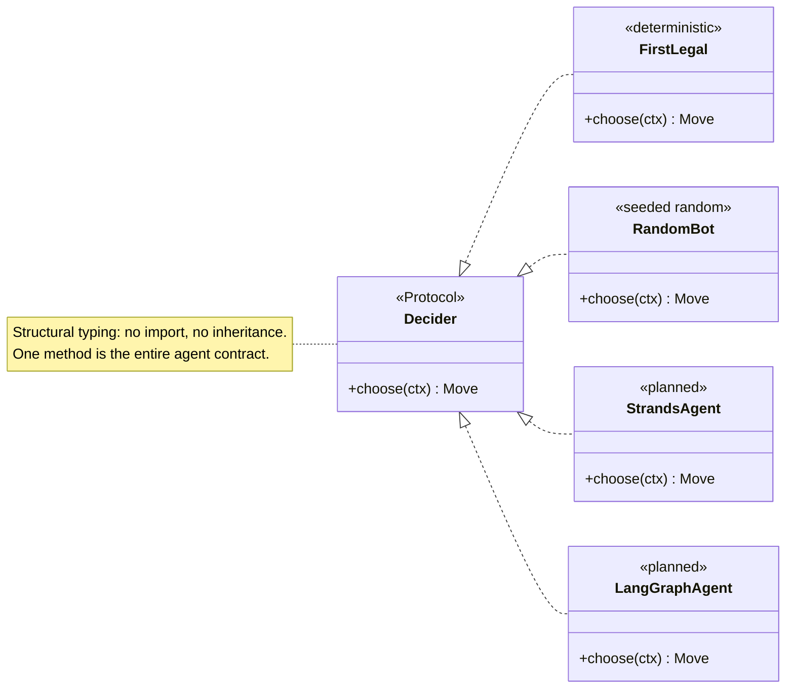
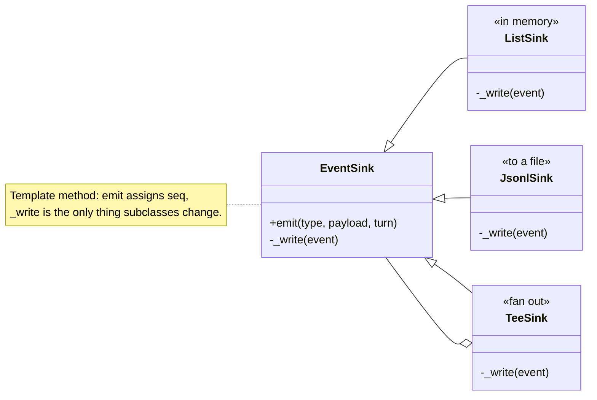
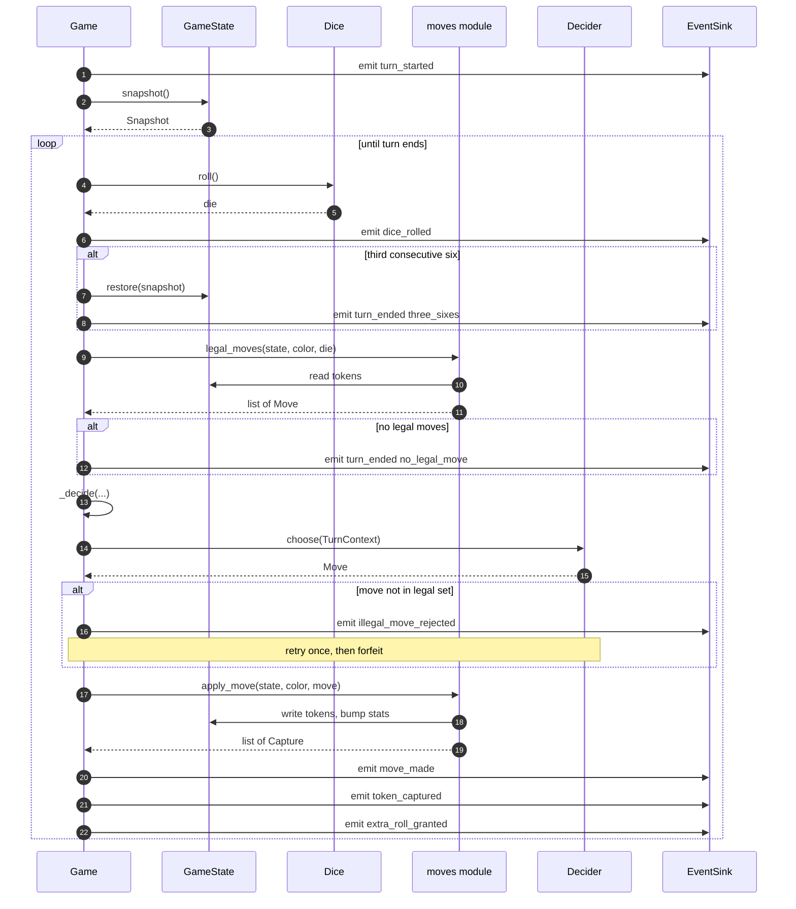
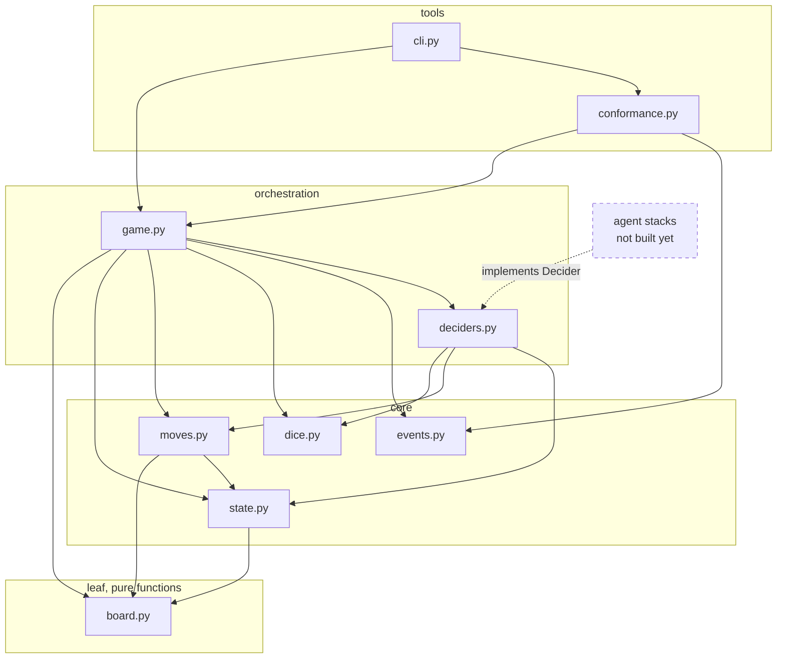
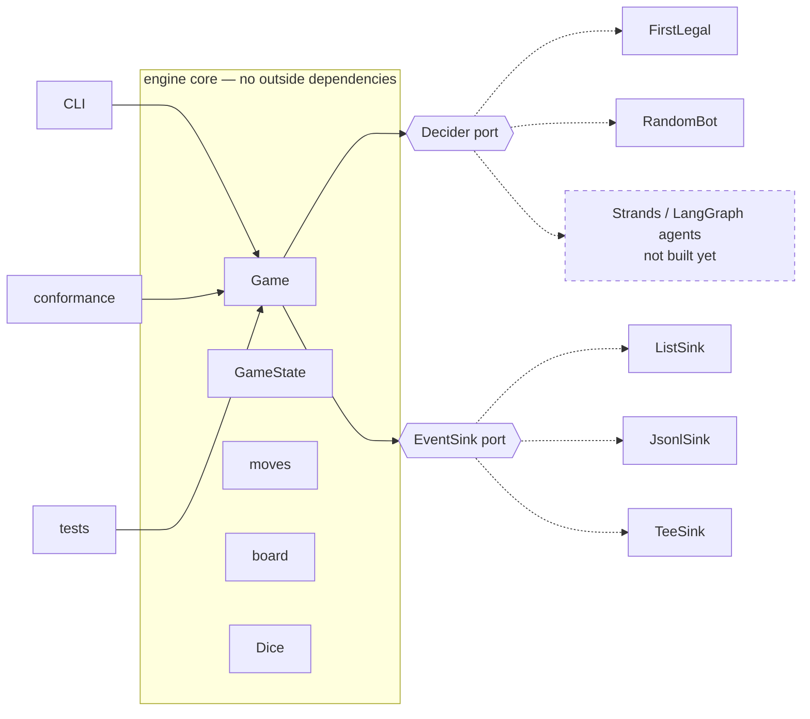

# LUDO Engine — Low-Level Class Design

The object graph as actually built, at method granularity: who owns what, who calls what, which relationships are inheritance versus something looser, and [which design patterns are genuinely in play](#7-design-patterns-in-play).

**This is a living document.** It covers the engine only, because that's all that exists. It grows as the agent stacks, UI, and eval harness arrive — see [What comes next](#what-comes-next).

Companion docs: [engine-design.md](engine-design.md) explains *why* these shapes were chosen; this one shows *how they connect*. For Python syntax itself, see [learning/python](../../../learning/python/).

---

## 1. The object graph

Methods only — field types are in the [reference table](#5-class-reference). Private helpers prefixed `_`.


### Reading the arrows

| Arrow | Means | Where it's used here |
|---|---|---|
| `<\|--` | **Inheritance** | Only `EventSink` → its three subclasses. The single hierarchy in the engine. |
| `<\|..` | **Realization** | `FirstLegal`/`RandomBot` satisfy `Decider`. Dotted because in Python this is *structural* — neither class names `Decider` anywhere. |
| `*--` | **Composition** | Owner creates it and controls its lifetime. `Game` creates its own `GameState` and `Dice`. |
| `o--` | **Aggregation** | Holds something it did not create. `Game` receives its `EventSink` from outside. |
| `..>` | **Dependency** | Uses transiently — constructs, returns, or calls, without holding. |

The two dotted-inheritance arrows are the design's centre of gravity. `FirstLegal` contains no reference to `Decider`; it qualifies purely by having a `choose` method of the right shape. That's what lets an agent in a completely separate package plug in without importing the engine.

---

## 2. The two extension points, zoomed in

Everything above is fixed machinery except these. They're where other code attaches.





`TeeSink` both **inherits from** `EventSink` and **holds** several — so `TeeSink(ListSink(), JsonlSink(fh))` writes to memory and disk under one shared sequence counter. It deliberately calls each child's `_write`, not `emit`, so children never renumber.

---

## 3. One turn, as calls

The interaction the class diagram can't show. This is `Game._play_turn` for a single turn that captures a token and earns an extra roll.



Two things this makes obvious that prose does not:

- **`Decider.choose` is the only inbound arrow from outside the engine.** One call, one turn. Everything else is the engine talking to itself.
- **The agent never touches `GameState`.** Only `moves` and `Game` write to it. That's the structural guardrail of [ADR-0004](../../decisions/adr-0004-structural-guardrails.md) — with the [one caveat](engine-design.md#one-honest-limit-on-the-guardrail) that `TurnContext` hands over a live reference.

---

## 4. Who calls what

Method-level, engine only.

| Caller | Calls | For |
|---|---|---|
| `Game.play` | `Game._emit_start`, `_next_player`, `_play_turn` · `standings()` · `EventSink.emit` · `Outcome()` | the outer loop |
| `Game._play_turn` | `Dice.roll` · `GameState.snapshot`/`restore`/`has_finished` · `legal_moves()` · `Game._decide`/`_apply`/`_end_turn` · `EventSink.emit` | one turn |
| `Game._decide` | `TurnContext()` · **`Decider.choose`** · `EventSink.emit` | ask the agent, validate |
| `Game._apply` | `apply_move()` · `to_square()` · `EventSink.emit` | move and report |
| `Game._next_player` | `GameState.has_finished` | rotate, skipping finishers |
| `GameState.snapshot` / `restore` | `Snapshot()`, `PlayerStats()` | copy in, copy out |
| `moves.legal_moves` | `to_square()`, `_can_land`, `_path_clear` | rule check |
| `moves.apply_move` | `to_square()`, `is_safe()` | move, capture, count |
| `RandomBot.choose` | `Dice.roll` | its own seeded stream |
| `TeeSink._write` | each child's `_write` | fan out, shared seq |
| `conformance.run_vector` | `Game.play`, `ListSink`, `digest()` | one deterministic game |

Note `board` is called by everyone and calls nobody — it's leaf-level pure functions.

---

## 5. Class reference

| Class | Kind | Module | Mutable | Purpose |
|---|---|---|---|---|
| `Game` | plain class | `game.py` | yes | the turn loop |
| `GameConfig` | dataclass | `game.py` | yes | seed, cap, player metadata |
| `Outcome` | dataclass | `game.py` | yes | result + `winner` property |
| `GameState` | dataclass | `state.py` | yes | tokens, stats, finish order |
| `PlayerStats` | dataclass | `state.py` | yes | three counters per colour |
| `Snapshot` | dataclass | `state.py` | frozen | turn-start copy for rollback |
| `Move` | dataclass | `moves.py` | frozen | must be hashable for `set` |
| `Capture` | dataclass | `moves.py` | frozen | what a move knocked out |
| `Dice` | plain class | `dice.py` | yes | portable seeded PRNG |
| `TurnContext` | dataclass | `deciders.py` | frozen | everything an agent may see |
| `Decider` | **Protocol** | `deciders.py` | — | the agent contract |
| `FirstLegal` | plain class | `deciders.py` | no | deterministic, for vectors |
| `RandomBot` | plain class | `deciders.py` | yes | seeded random, for benchmarks |
| `EventSink` | base class | `events.py` | yes | sequence numbering |
| `ListSink` / `JsonlSink` / `TeeSink` | subclasses | `events.py` | yes | memory / file / fan-out |

---

## 6. Module layering

Dependencies point one way only.



No arrow ever points back up, and nothing in the engine points at an agent framework. The only inbound edge from outside is dashed: a stack implements `Decider`. That is the whole integration surface.

---

## 7. Design patterns in play

Named honestly. Most "patterns in our codebase" documents over-claim — every dictionary becomes a Registry, every function a Factory. The table below marks whether each is **textbook** (all the roles are present and doing their job) or **approximate** (the shape rubs off, but calling it the pattern would be a stretch).

| Pattern | Source | Fit | Where |
|---|---|---|---|
| **Strategy** | GoF behavioural | textbook | `Decider` + `FirstLegal` / `RandomBot` |
| **Template Method** | GoF behavioural | textbook | `EventSink.emit` / `_write` |
| **Memento** | GoF behavioural | textbook | `GameState.snapshot` / `Snapshot` / `restore` |
| **Composite** | GoF structural | textbook | `TeeSink` |
| **Value Object** | DDD | textbook | `Move`, `Capture`, `Snapshot`, `TurnContext` |
| **Dependency Injection** | — | textbook | `Game(config, sink)`, `play(deciders)` |
| **Ports & Adapters** | Cockburn, hexagonal | textbook | two ports — see [7.6](#76-ports-and-adapters) |
| **Facade** | GoF structural | approximate | `Game.play` is one call over the subsystem, but hides nothing you're forbidden to touch |
| **Event Sourcing** | Fowler | approximate | consumers rebuild from the log, but the engine keeps authoritative state too |

### 7.1 Strategy — `Decider`

*Define a family of algorithms, encapsulate each, make them interchangeable.*

`Game` is the context; it never knows which algorithm it holds.

```python
move = decider.choose(ctx)          # game.py — one line, any strategy
```

Swapping `FirstLegal` for `RandomBot` for a Strands agent changes nothing in `Game`. This is what makes [conformance vectors](../../../shared/conformance/README.md) possible at all: the *same* engine runs deterministically under `FirstLegal` and non-deterministically under an LLM.

The Python twist is that the strategy interface is a `Protocol`, so implementations don't inherit from it — see [engine-design.md](engine-design.md#decider--a-protocol-not-a-base-class).

### 7.2 Template Method — `EventSink`

*Define an algorithm's skeleton, defer specific steps to subclasses.*

```python
def emit(self, type_, payload, turn=0):     # the skeleton — fixed
    event = {"seq": self._seq, ...}
    self._seq += 1
    self._write(event)                       # the hole — subclasses fill it

def _write(self, event):
    raise NotImplementedError
```

Sequence numbering is the invariant; the destination is the variable. A subclass *cannot* accidentally break `seq` contiguity, which the [event schema](../../../shared/schemas/README.md) requires — because it never gets to touch it.

### 7.3 Memento — `Snapshot`

*Capture an object's internal state so it can be restored later, without violating encapsulation.*

All three roles are present and distinct:

| Role | Class |
|---|---|
| Originator | `GameState` — makes and accepts the memento |
| Memento | `Snapshot` — opaque, frozen |
| Caretaker | `Game` — holds `before`, never looks inside it |

```python
before = self.state.snapshot()       # Game holds it, does not inspect it
...
self.state.restore(before)           # three sixes cancel the turn
```

`Game` treats `Snapshot` as a black box. It could not corrupt the board through it even if it tried — which is exactly the encapsulation the pattern exists to provide.

### 7.4 Composite — `TeeSink`

*Compose objects into trees; let clients treat one object and a group identically.*

```python
sink = TeeSink(ListSink(), JsonlSink(fh))   # Game cannot tell this from a ListSink
```

`TeeSink` **is an** `EventSink` and **has** `EventSink`s. `Game` holds one sink and never learns whether it's writing to one place or five. Nesting works too — a `TeeSink` of `TeeSink`s is valid.

### 7.5 Value Object — the frozen dataclasses

*Immutable, no identity, equality by value.*

```python
Move(0, 3, 5) == Move(0, 3, 5)      # True — same value, same thing
```

`Move`, `Capture`, `Snapshot`, and `TurnContext` have no lifecycle and no identity; two with the same fields are interchangeable. That's what lets `Move` live in a `set` and what makes `move in allowed` a meaningful question.

Contrast `Game` and `GameState`, which are **entities** — identity matters, and two states with identical tokens are still two different games.

### 7.6 Ports and Adapters

The most useful architectural reading of the engine. The core is surrounded by two **ports** — abstractions the core calls out through — with interchangeable **adapters** behind each.



- **Driving adapters** (left) call *into* the engine: the CLI, the conformance runner, the tests.
- **Driven ports** (right) are called *by* the engine: `Decider` for "what move?", `EventSink` for "here's what happened."

Two ports is the entire outside surface. That's why the engine has no LLM dependency and why the UI and eval harness can consume games without importing a single engine class.

### 7.7 SOLID, checked honestly

Not forced — the fit is genuinely good, and the one violation is real.

| | Verdict |
|---|---|
| **S**ingle Responsibility | ✅ `board` geometry · `moves` rules · `dice` randomness · `events` output · `game` sequencing |
| **O**pen/Closed | ✅ New sinks and new agents need zero edits to `Game` |
| **L**iskov Substitution | ✅ Any `EventSink` substitutes for any other; same for `Decider` |
| **I**nterface Segregation | ✅ `Decider` has exactly one method — about as segregated as an interface gets |
| **D**ependency Inversion | ✅ `Game` depends on `Decider` and `EventSink`, never on `RandomBot` or `JsonlSink` |

**Where it's bent — Law of Demeter:**

```python
self.state.stats[color].turns_forfeited += 1        # game.py
```

Four levels of reaching through. "Tell, don't ask" would put a `record_forfeit(color)` method on `GameState`. It's a genuine smell, small enough to have been left alone, and worth fixing if `Game` starts poking at more of `GameState`'s internals.

## 8. Patterns deliberately not used

| Not used | Why |
|---|---|
| Abstract base classes (`ABC`) | `Protocol` gives the contract without forcing agents to import the engine |
| **Observer** | Sounds right for events, but there's no runtime subscribe/unsubscribe — one injected sink, composed statically by `TeeSink`. Registration would add lifecycle bugs for no gain. |
| **Factory / Abstract Factory** | Construction is trivial and explicit. A factory here would be indirection with nothing behind it. |
| **Singleton** | Everything hangs off a `Game` instance, so tests run independently and games can run in parallel. A singleton engine would make both impossible. |
| **Command** | `Move` is data, not an object with `execute()`/`undo()`. Undo is handled by Memento at turn granularity, which is what the rules actually need. |
| Multiple inheritance / mixins | Nothing needs it; it would obscure a codebase meant to be read |
| Class hierarchies for data | Records are flat dataclasses. Composition instead of an inheritance tree. |
| Exceptions for control flow | A failed turn returns `None`; only genuinely exceptional agent errors are caught |

One inheritance hierarchy, one protocol, everything else composition. That's the whole structural vocabulary — and the patterns above are descriptions of what emerged from the constraints, not a checklist that was applied up front.

---

## What comes next

This diagram will grow. Expected additions, roughly in build order:

| Component | Shape it will take |
|---|---|
| **Agent stacks** | Each contributes a `Decider` implementation plus its own memory, negotiation, and context-compaction objects. They attach at the one dashed arrow above. |
| **`engine-java`** | Mirrors this graph, with `Protocol` becoming an `interface` and frozen dataclasses becoming `record`s — see [engine-design.md](engine-design.md#porting-to-java). |
| **Eval harness** | Reads transcripts only. Should appear with *no* arrow into the engine at all. |
| **UI** | Same — consumes the event stream, never the classes. |

If a future component needs an arrow *into* the engine that isn't `Decider`, that's worth challenging: it likely means something is bypassing the event stream.

---

## Viewing these diagrams

The blocks above are [Mermaid](https://mermaid.js.org/). They render automatically on GitHub, in VS Code with a Markdown preview extension, and in most JetBrains IDEs. In a plain terminal you'll see the source — which is still readable, and is why the tables duplicate the key relationships in text.
