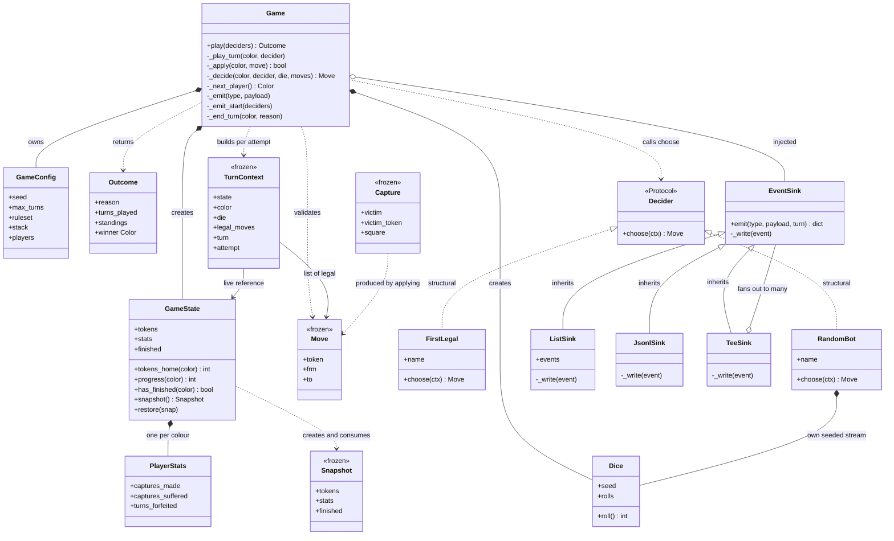
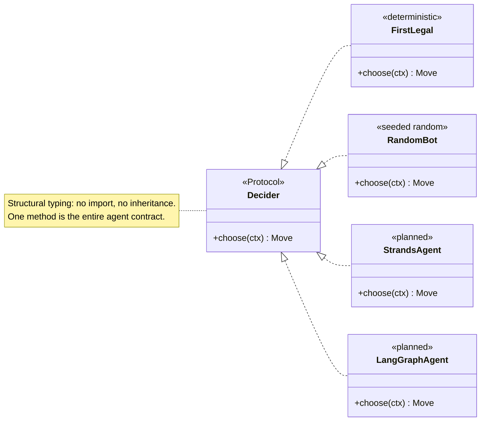
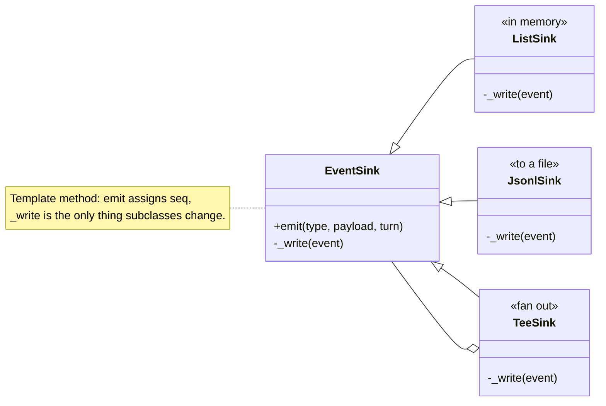
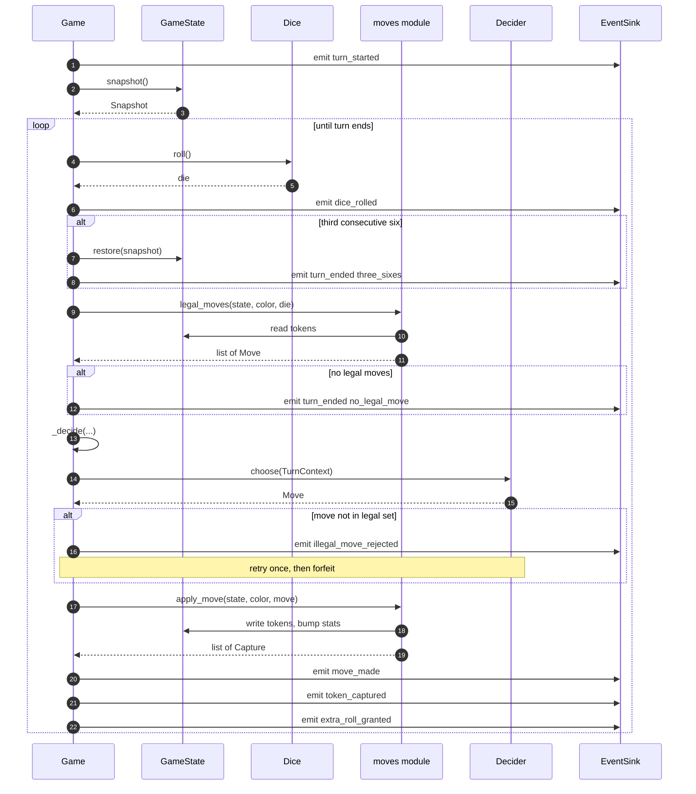
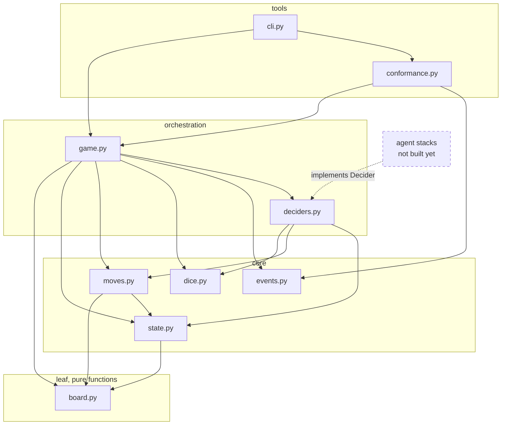
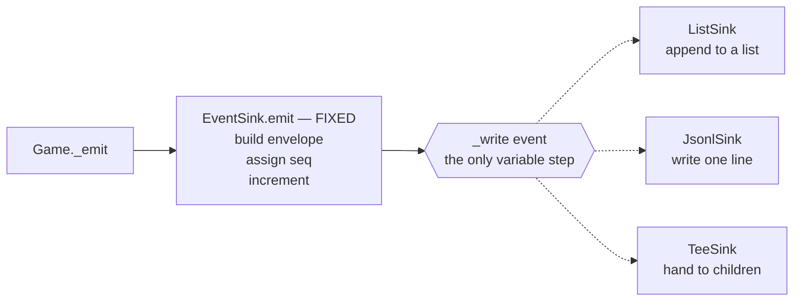
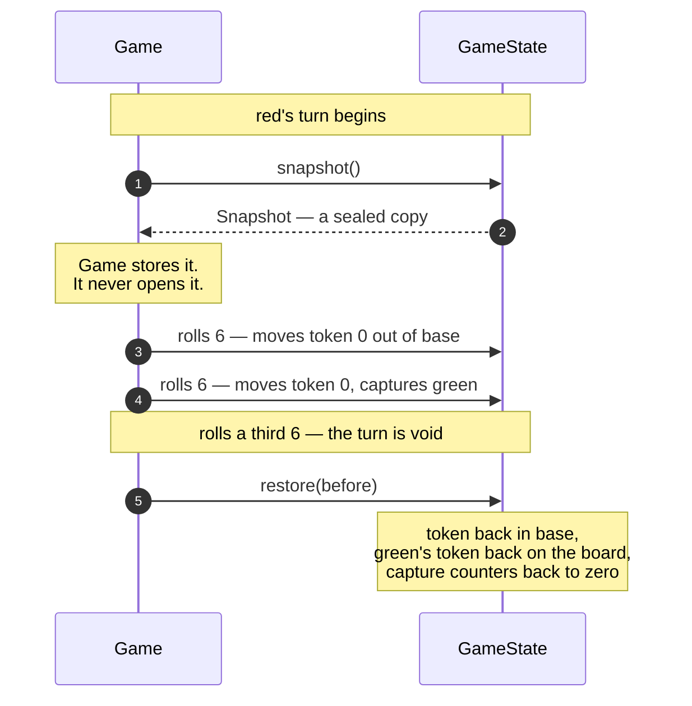
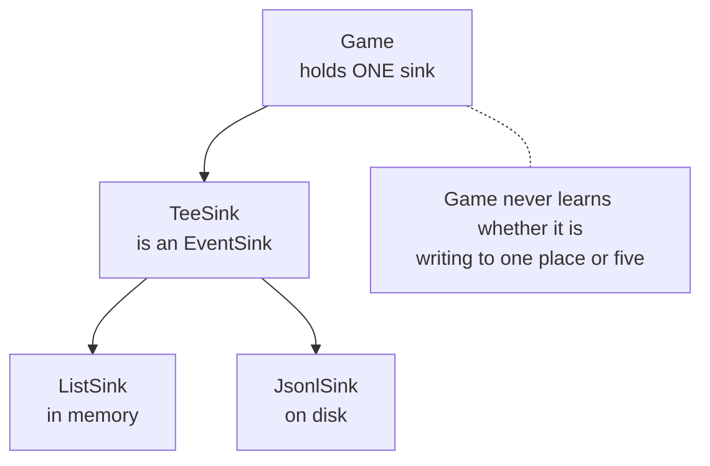
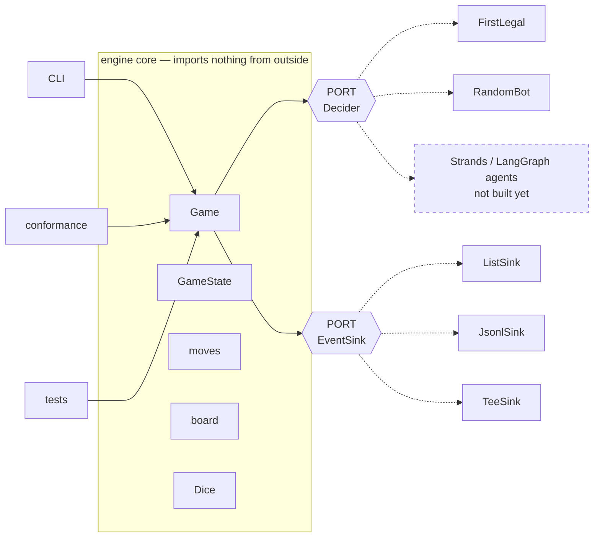

# LUDO Engine — Low-Level Class Design

The object graph as actually built, at method granularity: who owns what, who calls what, which relationships are inheritance versus something looser, and [which design patterns are genuinely in play](#7-design-patterns-from-the-problem-up).

**New to design patterns?** [Section 7](#7-design-patterns-from-the-problem-up) is written for you — each pattern starts from a problem this engine actually hit, shows the code you'd write first, shows what breaks, and only then names the thing.

**This is a living document.** It covers the engine only, because that's all that exists. It grows as the agent stacks, UI, and eval harness arrive — see [What comes next](#what-comes-next).

Companion docs: [engine-design.md](engine-design.md) explains *why* these shapes were chosen; this one shows *how they connect*. For Python syntax itself, see [learning/python](../../../learning/python/).

---

## 1. The object graph

Methods only — field types are in the [reference table](#5-class-reference). Private helpers prefixed `_`.



### Reading the arrows

| Arrow | Means | Where it's used here |
|---|---|---|
| `<\|--` | **Inheritance** | Only `EventSink` → its three subclasses. The single hierarchy in the engine. |
| `<\|..` | **Realization** | `FirstLegal`/`RandomBot` satisfy `Decider`. Dotted because in Python this is *structural* — neither class names `Decider` anywhere. |
| `*--` | **Composition** | Owner creates it and controls its lifetime. `Game` creates its own `GameState` and `Dice`. |
| `o--` | **Aggregation** | Holds something it did not create. `Game` receives its `EventSink` from outside. |
| `..>` | **Dependency** | Uses transiently — constructs, returns, or calls, without holding. |

The two dotted-inheritance arrows are the design's centre of gravity. `FirstLegal` contains no reference to `Decider`; it qualifies purely by having a `choose` method of the right shape. That's what lets an agent in a completely separate package plug in without importing the engine.

---

## 2. The two extension points, zoomed in

Everything above is fixed machinery except these. They're where other code attaches.





`TeeSink` both **inherits from** `EventSink` and **holds** several — so `TeeSink(ListSink(), JsonlSink(fh))` writes to memory and disk under one shared sequence counter. It deliberately calls each child's `_write`, not `emit`, so children never renumber.

---

## 3. One turn, as calls

The interaction the class diagram can't show. This is `Game._play_turn` for a single turn that captures a token and earns an extra roll.



Two things this makes obvious that prose does not:

- **`Decider.choose` is the only inbound arrow from outside the engine.** One call, one turn. Everything else is the engine talking to itself.
- **The agent never touches `GameState`.** Only `moves` and `Game` write to it. That's the structural guardrail of [ADR-0004](../../decisions/adr-0004-structural-guardrails.md) — with the [one caveat](engine-design.md#one-honest-limit-on-the-guardrail) that `TurnContext` hands over a live reference.

---

## 4. Who calls what

Method-level, engine only.

| Caller | Calls | For |
|---|---|---|
| `Game.play` | `Game._emit_start`, `_next_player`, `_play_turn` · `standings()` · `EventSink.emit` · `Outcome()` | the outer loop |
| `Game._play_turn` | `Dice.roll` · `GameState.snapshot`/`restore`/`has_finished` · `legal_moves()` · `Game._decide`/`_apply`/`_end_turn` · `EventSink.emit` | one turn |
| `Game._decide` | `TurnContext()` · **`Decider.choose`** · `EventSink.emit` | ask the agent, validate |
| `Game._apply` | `apply_move()` · `to_square()` · `EventSink.emit` | move and report |
| `Game._next_player` | `GameState.has_finished` | rotate, skipping finishers |
| `GameState.snapshot` / `restore` | `Snapshot()`, `PlayerStats()` | copy in, copy out |
| `moves.legal_moves` | `to_square()`, `_can_land`, `_path_clear` | rule check |
| `moves.apply_move` | `to_square()`, `is_safe()` | move, capture, count |
| `RandomBot.choose` | `Dice.roll` | its own seeded stream |
| `TeeSink._write` | each child's `_write` | fan out, shared seq |
| `conformance.run_vector` | `Game.play`, `ListSink`, `digest()` | one deterministic game |

Note `board` is called by everyone and calls nobody — it's leaf-level pure functions.

---

## 5. Class reference

| Class | Kind | Module | Mutable | Purpose |
|---|---|---|---|---|
| `Game` | plain class | `game.py` | yes | the turn loop |
| `GameConfig` | dataclass | `game.py` | yes | seed, cap, player metadata |
| `Outcome` | dataclass | `game.py` | yes | result + `winner` property |
| `GameState` | dataclass | `state.py` | yes | tokens, stats, finish order |
| `PlayerStats` | dataclass | `state.py` | yes | three counters per colour |
| `Snapshot` | dataclass | `state.py` | frozen | turn-start copy for rollback |
| `Move` | dataclass | `moves.py` | frozen | must be hashable for `set` |
| `Capture` | dataclass | `moves.py` | frozen | what a move knocked out |
| `Dice` | plain class | `dice.py` | yes | portable seeded PRNG |
| `TurnContext` | dataclass | `deciders.py` | frozen | everything an agent may see |
| `Decider` | **Protocol** | `deciders.py` | — | the agent contract |
| `FirstLegal` | plain class | `deciders.py` | no | deterministic, for vectors |
| `RandomBot` | plain class | `deciders.py` | yes | seeded random, for benchmarks |
| `EventSink` | base class | `events.py` | yes | sequence numbering |
| `ListSink` / `JsonlSink` / `TeeSink` | subclasses | `events.py` | yes | memory / file / fan-out |

---

## 6. Module layering

Dependencies point one way only.



No arrow ever points back up, and nothing in the engine points at an agent framework. The only inbound edge from outside is dashed: a stack implements `Decider`. That is the whole integration surface.

---

## 7. Design patterns, from the problem up

If you haven't met design patterns before, the usual way they're taught is backwards: here is a name, here is a diagram, here is a definition. But a pattern is an **answer**, and an answer only makes sense once you've felt the question.

So each one below starts with a problem this engine actually had. It shows the code you'd reasonably write first, shows what goes wrong, and only then names the thing. If you already know the patterns, skip to the [recap](#78-recap).

---

### 7.1 Four players, four different brains → **Strategy**

**The problem.** `Game` has to ask each player "what's your move?" But the players are wildly different things. Two exist today: `RandomBot` (picks at random, for benchmarking) and `FirstLegal` (always takes the first option, so conformance vectors stay reproducible). Three more are coming, each an LLM agent on a different framework — one of them in *Java*.

How does the turn loop ask the question without knowing who it's asking?

**What you'd write first.** The honest first attempt is a branch:

```python
# NOT what the engine does
if player_type == "random":
    move = random.choice(moves)
elif player_type == "first_legal":
    move = moves[0]
elif player_type == "strands":
    prompt = build_prompt(state, moves)
    reply = bedrock.invoke(prompt)        # <-- the engine now needs boto3
    move = parse(reply)
elif player_type == "langgraph":
    ...
```

Perfectly reasonable code. It also quietly destroys the project.

**What breaks.**

- The engine now imports an LLM SDK — [the one rule it must never break](../../architecture/repository-layout.md).
- Every new agent means editing `game.py`, the file whose correctness the conformance vectors depend on.
- Tests can't run without mocking a model provider.
- Adding a fourth agent means a fifth branch, forever.

**The fix.** Turn the question into a one-method contract, and let the caller supply the answerer:

```python
class Decider(Protocol):
    def choose(self, ctx: TurnContext) -> Move: ...
```

```python
move = decider.choose(ctx)      # game.py — every player, one line
```

Now `Game` *cannot* know what it's talking to. That inability is the feature.

```mermaid
flowchart TB
    subgraph before["BEFORE — Game knows every kind of player"]
        direction TB
        g1["Game._decide"] --> q{"what kind<br/>of player?"}
        q -->|random| b1["pick at random"]
        q -->|first legal| b2["take the first move"]
        q -->|strands| b3["build prompt<br/>call Bedrock<br/>parse reply"]
        q -->|langgraph| b4["build graph<br/>invoke<br/>parse reply"]
    end

    subgraph after["AFTER — Game knows one method"]
        direction TB
        g2["Game._decide"] --> call["decider.choose(ctx)"]
        call -.-> a1["RandomBot"]
        call -.-> a2["FirstLegal"]
        call -.-> a3["StrandsAgent"]
        call -.-> a4["LangGraphAgent"]
    end
```

**The name.** This is **Strategy** (Gang of Four, behavioural): *define a family of algorithms, encapsulate each one, make them interchangeable.* `Game` is the "context", `Decider` is the strategy interface, each agent is a concrete strategy.

The payoff isn't theoretical. It's why the *same* engine runs deterministically under `FirstLegal` for conformance vectors and non-deterministically under an LLM for a real game — with no code difference at all.

---

### 7.2 Every event needs a number, but events go to different places → **Template Method**

**The problem.** The [event schema](../../../shared/schemas/README.md) requires `seq` to start at 0 and never skip. But events go to different destinations: memory during tests, a `.jsonl` file when recording a game, sometimes both at once.

**What you'd write first.** Give each destination its own emit method:

```python
# NOT what the engine does
class ListSink:
    def emit(self, type_, payload, turn=0):
        self.events.append({"seq": self._seq, "turn": turn, ...})
        self._seq += 1

class JsonlSink:
    def emit(self, type_, payload, turn=0):
        self._stream.write(json.dumps({"seq": self._seq, ...}) + "\n")
        self._seq += 1
```

**What breaks.** The numbering logic is now copy-pasted, and copy-pasted logic drifts. Someone increments before building the envelope, or forgets `turn`, or resets the counter on flush. The transcript then fails schema validation — and it fails *silently*, staying wrong until the UI tries to replay it and hits a gap.

**The fix.** Write the algorithm once and leave exactly one hole:

```python
class EventSink:
    def emit(self, type_, payload, turn=0):
        event = {"seq": self._seq, "turn": turn, "type": type_, "payload": payload}
        self._seq += 1              # the invariant: fixed, shared, unbypassable
        self._write(event)          # the hole: the only thing that varies

    def _write(self, event):
        raise NotImplementedError
```

A subclass can't break `seq`, because it never gets to touch it.



**The name.** **Template Method** (GoF, behavioural): *define the skeleton of an algorithm in a base class, deferring specific steps to subclasses.* The skeleton is `emit`; the deferred step is `_write`.

Note the difference from Strategy. Strategy swaps out the *whole* algorithm; Template Method keeps the algorithm fixed and swaps out one *step*. Choosing between them is really a question of how much you want to vary.

---

### 7.3 Three sixes cancel the turn — including the capture → **Memento**

**The problem.** [The rules](game-rules.md) say three consecutive sixes forfeit the turn, and *everything done during it is cancelled*. By the time that third six lands, the player may have moved two tokens and captured an opponent. All of it must be undone.

**What you'd write first.** Two obvious approaches:

```python
# Attempt A — record what changed, reverse it
undo_log.append(("move", token, old_position))
undo_log.append(("capture", "green", 2, 44))
for action in reversed(undo_log):
    reverse(action)
```

```python
# Attempt B — let Game reset the fields directly
game.state.tokens[color] = saved_tokens
game.state.stats[color].captures_made = saved_captures
```

**What breaks.**

*Attempt A:* every rule now needs a matching un-rule, and the two must stay in sync forever. Add blocks, and you need un-block. Miss one and the board is subtly wrong, with no exception raised.

*Attempt B:* `Game` now knows the internal shape of `GameState`. Add a field to `GameState` and rollback silently stops restoring it. Nothing fails — the board is just quietly corrupt. That's the worst kind of bug, and [example 04](../../../learning/python/examples/04_mutability_and_copying.py) reproduces exactly this failure.

**The fix.** Let `GameState` package its own state into an opaque object, and let `Game` hold it *without ever looking inside*:

```python
before = self.state.snapshot()      # Game receives a sealed box
...
self.state.restore(before)          # and hands it back, unopened
```

`Game` never reads `before`. It couldn't corrupt the board through it if it tried. And when `GameState` grows a new field, only `snapshot`/`restore` change — the one place that already knows about it.



**The name.** **Memento** (GoF, behavioural): *capture an object's internal state so it can be restored later, without violating encapsulation.* All three roles are present and genuinely distinct:

| Role | Class | Job |
|---|---|---|
| Originator | `GameState` | makes the memento, accepts it back |
| Memento | `Snapshot` | the sealed, frozen copy |
| Caretaker | `Game` | holds it, never inspects it |

That "without violating encapsulation" clause is the entire point — and it is precisely what Attempt B gets wrong.

---

### 7.4 Record to a file *and* keep events in memory → **Composite**

**The problem.** The CLI needs both: stream the transcript to disk *and* keep the events around to print a summary at the end.

**What you'd write first.** Make `Game` accept a list:

```python
# NOT what the engine does
def __init__(self, config, sinks: list[EventSink]):
    self.sinks = sinks
...
for sink in self.sinks:
    sink.emit(...)        # each assigns its OWN seq — they now disagree
```

**What breaks.** `Game` grows a second code path, and the sequence numbers diverge because each sink counts independently. The file and the in-memory copy stop agreeing about what event #7 was.

**The fix.** Build a sink that *is* a sink and *contains* sinks:

```python
sink = TeeSink(ListSink(), JsonlSink(fh))   # Game can't tell this from a single sink
```

`TeeSink` inherits `emit`, so there's one shared counter; its `_write` hands the finished event to each child.



**The name.** **Composite** (GoF, structural): *compose objects into tree structures, and let clients treat individual objects and compositions uniformly.* Nesting works too — a `TeeSink` of `TeeSink`s is valid, and `Game` still can't tell.

---

### 7.5 "Is this one of the moves I allowed?" → **Value Object**

**The problem.** An agent hands back a `Move`. The engine must confirm it's one of the legal ones and reject it otherwise, because [an agent must not be able to cheat](../../decisions/adr-0004-structural-guardrails.md).

**What you'd write first.** The obvious check:

```python
if move in moves:      # with an ordinary class, `in` compares by IDENTITY
```

**What breaks.** The agent didn't return one of *our* objects — it built its own `Move(0, 3, 5)`. Same numbers, different object in memory. Identity comparison says "not legal", and **every legal move gets rejected**. Every turn forfeits. The game never progresses.

**The fix.** Make `Move` a *value*: immutable, with equality based on contents.

```python
@dataclass(frozen=True)
class Move:
    token: int
    frm: int
    to: int

Move(0, 3, 5) == Move(0, 3, 5)      # True — same value means same move
```

`frozen=True` does two jobs here. It makes equality-by-value safe, because the contents can't change after comparison. And it makes `Move` **hashable**, which unlocks the faster, clearer check the engine actually uses:

```python
allowed = set(moves)
if move in allowed: ...
```

**The name.** A **Value Object** (Domain-Driven Design): *no identity, equality by content, immutable.* `Move`, `Capture`, `Snapshot`, and `TurnContext` are all value objects.

Contrast `Game` and `GameState`, which are **entities** — identity matters. Two `GameState`s holding identical tokens are still two different games.

---

### 7.6 "The engine must never import an LLM SDK" → **Ports and Adapters**

**The problem.** That rule is easy to state and easy to break by accident — one convenient import during a late-night debugging session and it's gone. How do you make it *structural* instead of a note in a README?

**The fix.** Notice the engine only ever needs two things from the outside world:

1. Someone to answer **"what's your move?"**
2. Somewhere to put **"here's what happened"**

Give each one an abstraction the core calls out through — a **port** — and let anything at all implement it — an **adapter**. The core's import list is then closed by construction.



**Reading it.** Adapters on the **left** are *driving* — they call into the engine. Adapters on the **right** are *driven* — the engine calls out to them. The distinction is just direction of control.

**Why it matters here.** Two ports is the *entire* outside surface of the engine. That single fact is why:

- the engine has no LLM dependency, and can't acquire one by accident;
- the UI and eval harness consume recorded games without importing a single engine class;
- the Java engine can be a straight port, because there's nothing framework-specific to translate.

**The name.** **Ports and Adapters**, also known as Hexagonal Architecture (Alistair Cockburn). The "hexagon" is just a drawing convention for the core — the number of sides means nothing.

---

### 7.7 The principles underneath

The five patterns above aren't five unrelated inventions. They're applications of a smaller set of ideas, usually taught as **SOLID**. Checked honestly against this engine:

| Principle | Plain English | Here |
|---|---|---|
| **S**ingle Responsibility | one reason to change | ✅ `board` geometry · `moves` rules · `dice` randomness · `events` output · `game` sequencing |
| **O**pen/Closed | extend without editing | ✅ New sinks and new agents need zero edits to `Game` |
| **L**iskov Substitution | any subtype works where the type is expected | ✅ Any `EventSink` for any other; same for `Decider` |
| **I**nterface Segregation | small interfaces beat big ones | ✅ `Decider` has exactly one method |
| **D**ependency Inversion | depend on abstractions, not concretions | ✅ `Game` depends on `Decider`, never on `RandomBot` |

Notice that Strategy, Template Method, and Ports & Adapters are all really the *same two principles* — Open/Closed and Dependency Inversion — applied at different scales. That's more useful to remember than the individual names.

**Where it's bent.** One genuine violation, left in deliberately:

```python
self.state.stats[color].turns_forfeited += 1        # game.py
```

Four levels of reaching through another object's internals. This breaks the **Law of Demeter** ("only talk to your immediate neighbours"), and "tell, don't ask" would put a `record_forfeit(color)` method on `GameState` instead. It's small enough to have been left alone — but if `Game` starts poking at more of `GameState`'s internals, that's the signal to fix it.

---

### 7.8 Recap

| Pattern | Source | Fit | The problem it solved here |
|---|---|---|---|
| **Strategy** | GoF behavioural | textbook | Four kinds of player, one turn loop |
| **Template Method** | GoF behavioural | textbook | One numbering rule, three destinations |
| **Memento** | GoF behavioural | textbook | Undo a whole turn without exposing state |
| **Composite** | GoF structural | textbook | Write to file and memory as if to one place |
| **Value Object** | DDD | textbook | Compare moves by content, not identity |
| **Ports & Adapters** | Cockburn | textbook | Keep LLM SDKs structurally out of the engine |
| **Dependency Injection** | — | textbook | `Game` is handed its sink rather than choosing one |
| **Facade** | GoF structural | *approximate* | `Game.play` is one call over the subsystem — but it hides nothing you're forbidden to touch |
| **Event Sourcing** | Fowler | *approximate* | Consumers rebuild from the log — but the engine keeps authoritative state too |

"Textbook" means all the pattern's roles are present and doing their job. "Approximate" means the shape rubs off but calling it the pattern would be a stretch. Most "patterns in our codebase" documents skip this distinction and over-claim; every dictionary becomes a Registry, every function a Factory.

## 8. Patterns deliberately not used

| Not used | Why |
|---|---|
| Abstract base classes (`ABC`) | `Protocol` gives the contract without forcing agents to import the engine |
| **Observer** | Sounds right for events, but there's no runtime subscribe/unsubscribe — one injected sink, composed statically by `TeeSink`. Registration would add lifecycle bugs for no gain. |
| **Factory / Abstract Factory** | Construction is trivial and explicit. A factory here would be indirection with nothing behind it. |
| **Singleton** | Everything hangs off a `Game` instance, so tests run independently and games can run in parallel. A singleton engine would make both impossible. |
| **Command** | `Move` is data, not an object with `execute()`/`undo()`. Undo is handled by Memento at turn granularity, which is what the rules actually need. |
| Multiple inheritance / mixins | Nothing needs it; it would obscure a codebase meant to be read |
| Class hierarchies for data | Records are flat dataclasses. Composition instead of an inheritance tree. |
| Exceptions for control flow | A failed turn returns `None`; only genuinely exceptional agent errors are caught |

One inheritance hierarchy, one protocol, everything else composition. That's the whole structural vocabulary — and the patterns above are descriptions of what emerged from the constraints, not a checklist that was applied up front.

---

## What comes next

This diagram will grow. Expected additions, roughly in build order:

| Component | Shape it will take |
|---|---|
| **Agent stacks** | Each contributes a `Decider` implementation plus its own memory, negotiation, and context-compaction objects. They attach at the one dashed arrow above. |
| **`engine-java`** | Mirrors this graph, with `Protocol` becoming an `interface` and frozen dataclasses becoming `record`s — see [engine-design.md](engine-design.md#porting-to-java). |
| **Eval harness** | Reads transcripts only. Should appear with *no* arrow into the engine at all. |
| **UI** | Same — consumes the event stream, never the classes. |

If a future component needs an arrow *into* the engine that isn't `Decider`, that's worth challenging: it likely means something is bypassing the event stream.

---

## Viewing these diagrams

The blocks above are [Mermaid](https://mermaid.js.org/). They render automatically on GitHub, in VS Code with a Markdown preview extension, and in most JetBrains IDEs. In a plain terminal you'll see the source — which is still readable, and is why the tables duplicate the key relationships in text.
