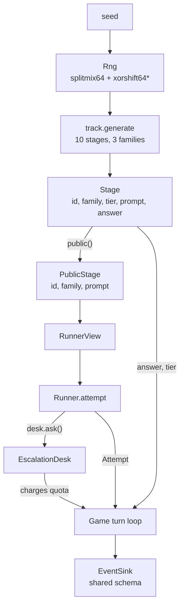

# RELAY Engine Design

How the [rules](game-rules.md) are implemented, and what a second implementation must preserve. The rules are normative; this file is the reasoning behind the code that obeys them.

Both engines are standard-library only, make no network calls, and import no model SDK — the constraint that keeps them fast, free, and testable, and that makes [conformance vectors](../../../shared/conformance/README.md) possible at all.

## The shape

Read the two arrows out of `Stage`. One goes to the runner and has been stripped; the other goes to the referee and has not. That fork is the whole design.

## The seal is a type, not a rule

A runner must never learn a stage's tier or its answer. That could have been a convention — *don't put it in the prompt* — and conventions decay under pressure, usually the pressure of a harness that would find it convenient.

So it is structural. `Stage` carries five fields; `PublicStage` carries three. `RunnerView` is built from a `PublicStage` and nothing else, so there is no field to reach for and no accessor to forget to guard. A harness that wanted to cheat would have to be handed a `Stage`, and the only thing that holds one is the engine.

The transcript follows the same split: `track_generated` emits prompts, `game_ended` emits `track_key` with every tier and answer. A UI can therefore replay a race honestly *and* explain it afterwards, which is what [ADR-0007](../../decisions/adr-0007-ui-alongside-first-stack.md)'s fixture rules will test.

## Escalation is performed by the engine

The obvious design is a boolean on the runner's answer: *I used the anchor.* It is also unsound in two directions — a runner could under-report to look clever, and a harness could over-report by mistake, and the quota is charged on a number nobody can check.

Instead the engine owns the seam. `EscalationDesk.ask()` charges the shared pool, calls the configured anchor, and returns the answer. `escalated` in the transcript is the desk's own record.

The anchor arrives as `GameConfig.anchor` — a plain callable taking a `PublicStage` and returning a string:

- **engine-only runs** pass `None`, and the desk answers from `stage.answer`: a *perfect* anchor. That is an assumption, not a fact, and it makes every bench number optimistic by exactly the anchor's real error rate. Stated here so nobody has to discover it.
- **a harness** passes a closure over its real anchor model. It receives the public stage, so the harness cannot see the answer either.

This is the same trick as the `Runner` protocol itself, one level down: the engine names a shape and stays ignorant of what fills it. In Python that is structural typing and costs nothing; in Java it is an interface the stack must `implement`, which is [the recorded finding](../../architecture/stack-comparison.md#finding-the-java-agent-must-depend-on-the-engine-the-python-agents-need-not) showing up for the third time.

## Why ticks and not milliseconds

RELAY is a project about latency, and its clock is a table of integers.

Wall-clock racing would be truer to the theme and would destroy everything downstream: two runs of one seed would diverge, the conformance vectors could not exist, the committed fixtures could not be byte-reproducible, and a slow afternoon on a loaded laptop would look like a strategic error.

So the engine charges constants — 2 to answer, 5 to escalate, 4 more to be wrong, 3 to pass — and the *measurement* of real latency rides on `llm_call.latency_ms`, where it is analysed and never adjudicated. The game is deterministic; the finding is empirical; neither contaminates the other.

The prices encode the trade the game is about: escalating costs more than answering even when it works, so a runner that escalates everything loses on the clock long before it loses on the quota.

## Generating a track two languages agree on

The stage prompts ride inside the transcript, so they are inside the conformance digest. Byte-identical generation across Python and Java is not a nicety here — it is most of the porting work, and it is where ALIBI's corpus already taught the lesson.

Rules the generators follow, all of them load-bearing:

- **ASCII only, integers only.** No locale-sensitive formatting anywhere; `str(value)` and `Integer.toString(value)` must agree, including on negatives.
- **Plain concatenation.** Sentences are built as a list and joined with one space. No template engine, no formatter with a rounding mode.
- **Draw order is spec.** Tiers are shuffled once, then each stage draws its family and then its body. `Rng.sample` shuffles a copy of the *whole* pool and takes the first k, so it consumes `len(pool) - 1` draws; a port that draws k times produces a different track from the same seed.
- **Fisher–Yates runs high index down.** Same reason.
- **The tier never reaches the prose.** A generator that made tier-3 sentences longer would hand the runners the one thing the game asks them to judge — and it would pass every test that only checks answers.

## The bots

Two, with different jobs, mirroring the split both earlier engines settled into.

**`ladder-runner`** is deterministic and is what the conformance vectors run on. Its competence is a program's competence: flawless at mechanical work, helpless at inference. It solves `chain` and shift-stated `cipher` stages **by parsing the prompt it was shown** — not by peeking at the answer, which would make the vectors prove nothing about the view — escalates everything else, and guesses once the pool is empty.

A useful accident falls out of that: four identical bots on one track produce four identical lanes, so a port that breaks lane symmetry has a bug, and the vectors catch it without anybody writing a test for it.

**`profile-runner`** is a measuring device rather than a player, and it says so: it is handed the track at construction and therefore knows every answer. It models a runner by two numbers — *skill* per tier, and *insight*, how often it correctly senses that a stage is beyond it. Sweeping the pair is how [question 25](../../open-questions.md) got answered, including the [inversion nobody predicted](game-rules.md#does-the-escalation-decision-actually-matter).

## What a port must preserve

In rough order of how likely it is to break:

1. **Stage prompts, byte for byte** — including spaces around joins and the trailing question marks.
2. **RNG draw order** — tiers, then per stage family then body; `sample` consumes the whole pool.
3. **`ladder-runner`'s parsers** — the same tokenisation, the same handling of the full stop that rides along with the ciphertext.
4. **Tick arithmetic and the order it is applied** — the wrong-answer penalty is added on top of the action's own cost.
5. **Standings ordering** — stages cleared, then ticks, then canonical lane order.
6. **The seal** — `track_generated` without tiers, `game_ended` with them.

Everything on that list is covered by the digest. Nothing on it is covered by a friendly error message, which is why the vectors exist.

## Related

- [Game rules](game-rules.md) — normative
- [Brief](brief.md) — what the project is for
- [Harness contract](harness-contract.md) — what a stack must do above this line
- [ADR-0002](../../decisions/adr-0002-engine-per-language.md) — why there are two engines at all
- [engine-python README](../../../projects/relay/engine-python/README.md) — the module map
