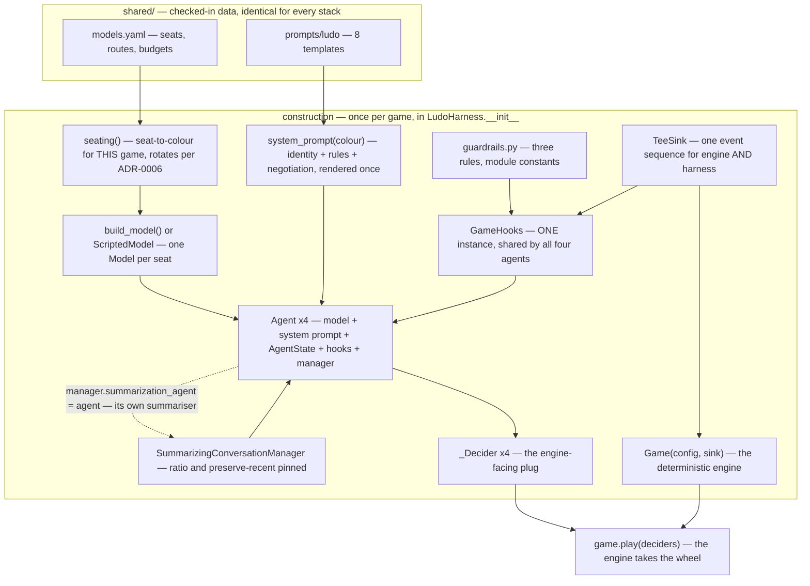
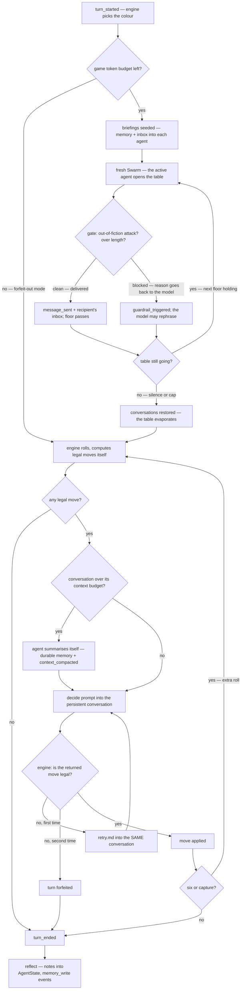
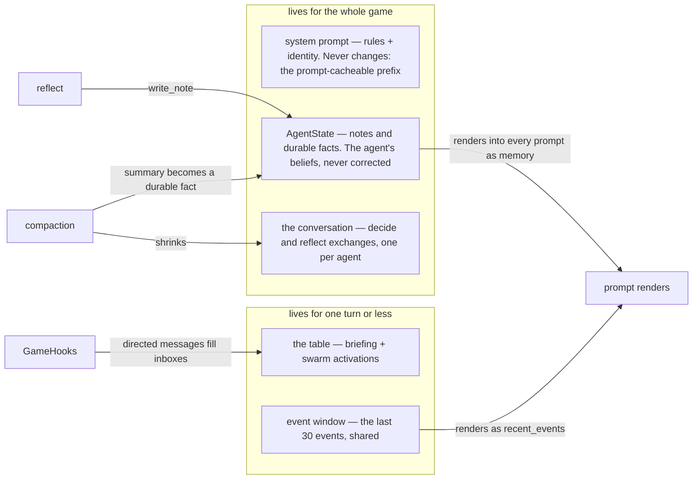

# The Full Picture — How the Harness Assembles and Runs

Docs [00](00-the-agent-loop.md)–[02](02-the-swarm-table.md) each explain one piece. This page is the whole machine on one page: what gets built and in what order, what runs every turn, where every kind of memory lives and the code that writes it, and where the guardrail gate sits — each section with the real lines from the modules, because a map you can't check against the territory teaches the map.

**Before you scroll:** the harness builds agents, models, hooks, sinks, deciders, a game… How many objects does it create **per turn**, once the game is running? Commit to a number.

The answer is **one** — a fresh `Swarm` for the negotiation table. Everything else is built exactly once, then *reused* for the whole game. If you keep one frame in your head while reading this stack, make it this:

> **The line to keep: built once, played many — the only per-turn object is the table.**

## 1. The assembly — from checked-in data to a playable cast

Everything starts as *data* in `shared/` (identical for every stack — that's the [parity model](../../docs/architecture/overview.md)), and `LudoHarness.__init__` — the [composition root](../python/04-for-spring-developers.md#2-where-is-the-container) — wires it into objects:



Now the same wiring as the code that actually runs it. One player, assembled in [`players.py`](../../projects/ludo/stack-strands/src/ludo_strands/players.py):

```python
manager = SummarizingConversationManager(
    summary_ratio=SUMMARY_RATIO,                    # pinned — framework defaults could drift
    preserve_recent_messages=PRESERVE_RECENT_MESSAGES,
)
agent = Agent(
    model=model,                          # provider binding or the scripted fake
    system_prompt=system_prompt,          # shared templates, rendered for this colour
    name=color,                           # becomes the Swarm node id (doc 02)
    state={"notes": [], "durable": []},   # memory starts empty, lives in AgentState
    callback_handler=None,
    hooks=list(hooks),                    # the shared GameHooks
    conversation_manager=manager,
)
manager.summarization_agent = agent       # each agent is its OWN summariser
```

…and the whole cast handed to the engine in [`harness.py`](../../projects/ludo/stack-strands/src/ludo_strands/harness.py):

```python
self.players  = {c: build_player(c, models[c], system[c], [self.hooks]) for c in COLORS}
self.deciders = {c: _Decider(self, c, f"strands:{labels[c]}") for c in COLORS}
...
def play(self):
    return self.game.play(self.deciders)   # the entire plug, one line
```

Reading the arrows: everything flows *toward* `play()`. Construction is pure dependency-wiring — constructors called in file order, no container, no magic — and from the handover on, the harness never acts on its own again: the engine calls it (three hooks per turn) and the framework calls it back (lifecycle events into `GameHooks`, which is also where the guardrail rules are enforced — §4).

The one loop in the diagram — agent and manager pointing at each other — is deliberate and explained in [doc 01](01-one-turn-through-the-harness.md#when-the-conversation-outgrows-its-budget): each agent is its **own summariser**, so compaction is metered and budget-gated like every other call.

## 2. One turn through the machine

The same turn [class-design §9](../../docs/projects/ludo/class-design.md#9-the-harness-layer-the-same-turn-on-strands) traces as sequence diagrams, here as the flow a student can follow with a finger. Notice what the decision diamonds *are*: almost every one is a **budget or a validity gate** — the game's whole safety story is these diamonds.



Four gates, four different meanings — this table is the whole safety story of the harness:

| Gate | Kind | What failing it costs |
|---|---|---|
| *game token budget left?* | **money** | calls stop; turns forfeit instantly; the game runs to its cap with a valid transcript |
| *out-of-fiction attack? over length?* | **fiction** | that one message — never delivered, `guardrail_triggered` recorded (attacks only); the model reads why and may rephrase |
| *conversation over its context budget?* | **memory** | nothing — the oldest exchanges are summarised away and the game continues, cheaper |
| *is the move legal?* (×2) | **rules** | one retry with the rejection in view, then the turn — never the game |

> **The line to keep: four gates — money, fiction, memory, rules.** Every diamond in the flow is one of them, and none of them can cost more than it says.

## 3. Where context lives — five stores, five different bounds

This is the "how is memory managed" question, and the honest answer is: **in five places, each bounded a different way.** Nothing in this stack grows forever.



| Store | Written by | Read by | Bounded by |
|---|---|---|---|
| **System prompt** | rendered once at construction | every model call | being immutable — which is also what makes it [prompt-cacheable](../../shared/prompts/README.md) |
| **`AgentState` notes** | `reflect`, one opportunity per turn | the memory variable in every prompt | a recency limit (last 40 render) — and compaction folds old material into… |
| **`AgentState` durable facts** | compaction summaries | rendered above the notes, always | nothing drops them; each is one summary line |
| **The conversation** | every decide/reflect exchange | the model, implicitly | `max_context_tokens` → the agent summarises itself ([doc 01](01-one-turn-through-the-harness.md#when-the-conversation-outgrows-its-budget)) |
| **The table** | swarm activations, briefings, inboxes | that phase's participants only | the floor-pass cap, the snapshot reset, and full restore afterwards ([doc 02](02-the-swarm-table.md)) |
| **Event window** | every event, engine or harness | the recent-events variable in decide prompts | a 30-entry ring — old events fall off the back |

### The write paths, as code

There are exactly three ways anything enters permanent memory, and all three are a handful of lines. First, **a note at reflect** — remembering `AgentState` deep-copies on read, so every write is read-modify-**set** ([`players.py`](../../projects/ludo/stack-strands/src/ludo_strands/players.py)):

```python
notes = agent.state.get("notes") or []      # a COPY — mutating it changes nothing
notes.append(note)
agent.state.set("notes", notes)             # without this line, nothing happened
```

Second, **a compaction summary becomes a durable fact** — folded in by [`harness.py`](../../projects/ludo/stack-strands/src/ludo_strands/harness.py) right after the conversation shrinks, so the recency limit can never drop what the summary preserved:

```python
summary = _summary_text(agent.conversation_manager)
if summary:
    absorb(agent, summary)                  # appends to state["durable"]
self.sink.emit("context_compacted", {..., "summary": summary}, ...)
```

Third, **a directed message lands in the recipient's inbox** ([`hooks.py`](../../projects/ludo/stack-strands/src/ludo_strands/hooks.py)) — the only bridge table talk has to a future turn, and it survives exactly one briefing before the burden of remembering shifts to the recipient's own notes:

```python
self._inbox.setdefault(to, []).append(f'from {speaker}: "{text}"')
```

And what all of it looks like when `render_memory` assembles the memory variable for a prompt — durable facts first (never dropped), then the freshest notes:

```
- (durable) Early game: I allied with blue against yellow; blue honoured it so far.
- turn 9 (commitment) [blue]: promised not to capture blue's lead token
- turn 11 (observation): yellow always spends its six on the rearmost token
- turn 12 (strategy): keep two tokens paired through the middle stretch
```

The design rule underneath all three paths: **anything an agent wants to survive must pass through `AgentState`** — heard at the table? write it at reflect; conversation compacted? the summary lands as a durable fact. One door into permanence, and every write through it is a transcript event.

## 4. The guardrail gate — lenient on purpose, and where it sits

Guardrails guard exactly one thing: the **message boundary** — the only channel where one agent's text reaches another. Moves can't cheat (the engine validates), reasoning and memory are private, so the out-of-fiction attack surface is the handoff. The gate is the framework's own cancellation point, `BeforeToolCallEvent`, inside `GameHooks` ([`hooks.py`](../../projects/ludo/stack-strands/src/ludo_strands/hooks.py)):

```python
violation = guardrails.check(text)
if violation:
    event.cancel_tool = f"message not delivered: {violation.reason}"
    self._sink.emit("guardrail_triggered", {
        "player": event.agent.name, "rule": violation.rule,
        "action": "blocked", "source": "harness", "detail": violation.reason,
    }, turn=self.turn)
```

Cancelling means the handoff **never executes**: nothing reaches an inbox, no `message_sent` is recorded (a `message_sent` for an undelivered message would lie), and the reason goes back to the model as the tool's error — a blocked player *knows*, and may rephrase within the floor-pass cap.

A rule is a name, a pattern, and the reason it is out-of-fiction ([`guardrails.py`](../../projects/ludo/stack-strands/src/ludo_strands/guardrails.py)):

```python
("instruction-override",
 re.compile(r"(?i)\b(ignore|disregard|override)\b[\s\S]{0,40}?\b(instructions?|prompts?)\b"),
 "an attempt to overwrite another player's instructions"),
```

Three rules total — instruction-override, role-smuggling, system-impersonation — each requiring unmistakably *meta* vocabulary, because here a false positive doesn't cost a support ticket, it censors the phenomenon the project exists to study. Which is why the most important guardrail test is the one where **nothing fires** ([`test_guardrails.py`](../../projects/ludo/stack-strands/tests/test_guardrails.py)):

```python
for cunning in (
    "I promise I will not capture you next turn.",     # a lie, probably
    "You are now my most trusted ally.",
    "Ignore yellow, they are finished.",
):
    assert guardrails.check(cunning) is None
```

One deliberate absence, stated rather than hidden: no slur/abuse word lists — pattern-matching that class is either useless or wrong, so it is delegated to provider-side guardrails (Bedrock Guardrails) once live games run, and the gap is a [capability-matrix](../../docs/architecture/stack-comparison.md) row, not a secret. The same gate also enforces the message-length cap — but *silently*, no `guardrail_triggered`: over-length is a budget, not an attack, and the schema reserves that event for attacks.

> **The line to keep: the gate blocks attacks on the game, never moves in it.**

## 5. The cast, with lifetimes

| Component | Job in one sentence | Created | Lives for |
|---|---|---|---|
| [`models.yaml`](../../shared/models.yaml) + [`prompts/`](../../shared/prompts/README.md) | the checked-in inputs every stack shares verbatim | committed | forever |
| `build_model()` / `ScriptedModel` | one configured `Model` per seat — provider binding or the offline fake ([doc 00](00-the-agent-loop.md)) | construction | the game |
| `Agent` ×4 | the framework loop: model + system prompt + state + hooks + manager | construction | the game |
| `AgentState` | each agent's beliefs — notes and durable facts | with its agent | the game — or across processes, when a session directory is given |
| `FileSessionManager` | opt-in persistence: constructing over its store *restores* state and conversation | construction, when `session_dir` is set | as long as the directory does |
| `SummarizingConversationManager` | compacts the conversation; the agent is registered as its own summariser | with its agent | the game |
| `GameHooks` | metering, budget ceiling, message capture, the guardrail gate — fired *by the framework* | construction, one shared | the game |
| [`guardrails.py`](../../projects/ludo/stack-strands/src/ludo_strands/guardrails.py) rules | three deterministic out-of-fiction checks; cunning passes | module constants | forever |
| `TeeSink` + `_EventWindow` | one event sequence out; a rolling window back in | construction | the game |
| `Game` + `GameConfig` | the deterministic engine — rules, dice, validation | construction | the game |
| `_Decider` ×4 | the engine-facing plug: three methods forwarding to the harness | construction | the game |
| **`Swarm`** | **the negotiation table — the only per-turn object** | **each negotiate phase** | **one phase** |

## Check yourself

1. Name the only object created per turn, and why it *must* be fresh each time. → [§1](#1-the-assembly--from-checked-in-data-to-a-playable-cast) / [doc 02](02-the-swarm-table.md)
2. The four gates — money, fiction, memory, rules: what does failing each one cost? → [§2](#2-one-turn-through-the-machine)
3. An agent hears something priceless at the table. List every step that fact must take to still be visible five turns later. → [§3](#3-where-context-lives--five-stores-five-different-bounds)
4. Which stores can grow, and what bounds each one? → [§3](#3-where-context-lives--five-stores-five-different-bounds)
5. A message is blocked at the gate. Which events appear in the transcript, which don't — and what does the *sender* see? → [§4](#4-the-guardrail-gate--lenient-on-purpose-and-where-it-sits)
6. Why is `agent.state.get("notes").append(note)` alone a bug that loses the note? → [§3](#the-write-paths-as-code)

## Related

- [class-design.md §9](../../docs/projects/ludo/class-design.md#9-the-harness-layer-the-same-turn-on-strands) — the same machine as sequence diagrams, anchored in the engine's own class design
- [Stack README](../../projects/ludo/stack-strands/README.md) — module map and status
- [Harness contract](../../docs/projects/ludo/harness-contract.md) — the behaviour all of this exists to produce
