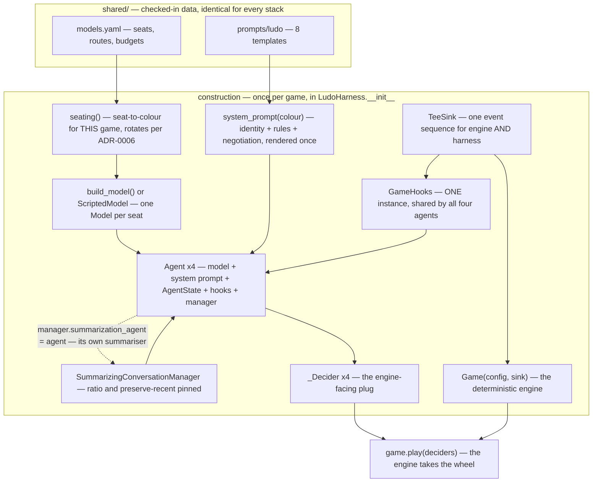
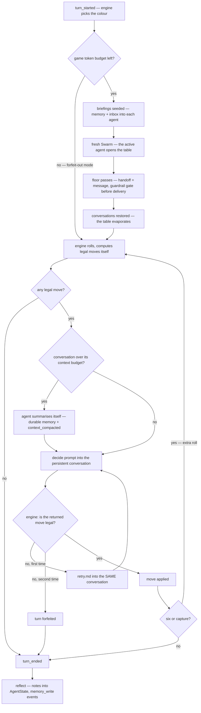
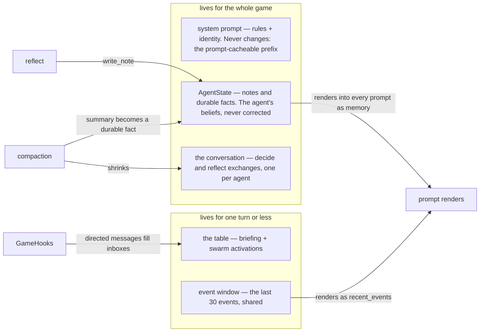

# The Full Picture — How the Harness Assembles and Runs

Docs [00](00-the-agent-loop.md)–[02](02-the-swarm-table.md) each explain one piece. This page is the whole machine on one page: what gets built, in what order, what runs every turn, and where every kind of memory lives.

**Before you scroll:** the harness builds agents, models, hooks, sinks, deciders, a game… How many objects does it create **per turn**, once the game is running? Commit to a number.

The answer is **one** — a fresh `Swarm` for the negotiation table. Everything else is built exactly once, then *reused* for the whole game. If you keep one frame in your head while reading this stack, make it this:

> **The line to keep: built once, played many — the only per-turn object is the table.**

## 1. The assembly — from checked-in data to a playable cast

Everything starts as *data* in `shared/` (identical for every stack — that's the [parity model](../../docs/architecture/overview.md)), and `LudoHarness.__init__` — the [composition root](../python/04-for-spring-developers.md#2-where-is-the-container) — wires it into objects:

Reading the arrows: everything flows *toward* `play()`. Construction is pure dependency-wiring — constructors called in file order, no container, no magic — and the last line hands the four `_Decider` plugs to the engine. From that moment the harness never acts on its own again: the engine calls it (three hooks per turn) and the framework calls it back (lifecycle events into `GameHooks`).

The one loop in the diagram — agent and manager pointing at each other — is deliberate and explained in [doc 01](01-one-turn-through-the-harness.md#when-the-conversation-outgrows-its-budget): each agent is its **own summariser**, so compaction is metered and budget-gated like every other call.

## 2. One turn through the machine

The same turn [class-design §9](../../docs/projects/ludo/class-design.md#9-the-harness-layer-the-same-turn-on-strands) traces as sequence diagrams, here as the flow a student can follow with a finger. Notice what the decision diamonds *are*: almost every one is a **budget or a validity gate** — the game's whole safety story is these diamonds.

Three gates, three different meanings, worth keeping apart:

| Gate | Kind | What happens past it |
|---|---|---|
| *game token budget left?* | money | calls stop; turns forfeit instantly; the game runs to its cap with a valid transcript |
| *conversation over its context budget?* | memory | the oldest exchanges are summarised away — the game continues, cheaper |
| *is the move legal?* (×2) | rules | one retry with the rejection in view, then the turn is lost — never the game |

## 3. Where context lives — five stores, five different bounds

This is the "how is memory managed" question, and the honest answer is: **in five places, each bounded a different way.** Nothing in this stack grows forever.

| Store | Written by | Read by | Bounded by |
|---|---|---|---|
| **System prompt** | rendered once at construction | every model call | being immutable — which is also what makes it [prompt-cacheable](../../shared/prompts/README.md) |
| **`AgentState` notes** | `reflect`, one opportunity per turn | the memory variable in every prompt | a recency limit (last 40 render) — and compaction folds old material into… |
| **`AgentState` durable facts** | compaction summaries | rendered above the notes, always | nothing drops them; each is one summary line |
| **The conversation** | every decide/reflect exchange | the model, implicitly | `max_context_tokens` → the agent summarises itself ([doc 01](01-one-turn-through-the-harness.md#when-the-conversation-outgrows-its-budget)) |
| **The table** | swarm activations, briefings, inboxes | that phase's participants only | the floor-pass cap, the snapshot reset, and full restore afterwards ([doc 02](02-the-swarm-table.md)) |
| **Event window** | every event, engine or harness | the recent-events variable in decide prompts | a 30-entry ring — old events fall off the back |

The design rule underneath the table: **anything an agent wants to survive must pass through `AgentState`** — heard at the table? write it at reflect; conversation compacted? the summary lands as a durable fact. One door into permanence, and every write through it is a transcript event.

## 4. The cast, with lifetimes

| Component | Job in one sentence | Created | Lives for |
|---|---|---|---|
| [`models.yaml`](../../shared/models.yaml) + [`prompts/`](../../shared/prompts/README.md) | the checked-in inputs every stack shares verbatim | committed | forever |
| `build_model()` / `ScriptedModel` | one configured `Model` per seat — provider binding or the offline fake ([doc 00](00-the-agent-loop.md)) | construction | the game |
| `Agent` ×4 | the framework loop: model + system prompt + state + hooks + manager | construction | the game |
| `AgentState` | each agent's beliefs — notes and durable facts | with its agent | the game (a session manager would extend this; not wired yet) |
| `SummarizingConversationManager` | compacts the conversation; the agent is registered as its own summariser | with its agent | the game |
| `GameHooks` | metering, budget ceiling, message capture, the guardrail gate — fired *by the framework* | construction, one shared | the game |
| [`guardrails.py`](../../projects/ludo/stack-strands/src/ludo_strands/guardrails.py) rules | three deterministic out-of-fiction checks; cunning passes | module constants | forever |
| `TeeSink` + `_EventWindow` | one event sequence out; a rolling window back in | construction | the game |
| `Game` + `GameConfig` | the deterministic engine — rules, dice, validation | construction | the game |
| `_Decider` ×4 | the engine-facing plug: three methods forwarding to the harness | construction | the game |
| **`Swarm`** | **the negotiation table — the only per-turn object** | **each negotiate phase** | **one phase** |

## Check yourself

1. Name the only object created per turn, and why it *must* be fresh each time. → [§1](#1-the-assembly--from-checked-in-data-to-a-playable-cast) / [doc 02](02-the-swarm-table.md)
2. The three diamonds in the turn flow gate three different resources — name them and what failing each one costs. → [§2](#2-one-turn-through-the-machine)
3. An agent hears something priceless at the table. List every step that fact must take to still be visible five turns later. → [§3](#3-where-context-lives--five-stores-five-different-bounds)
4. Which stores can grow, and what bounds each one? → [§3](#3-where-context-lives--five-stores-five-different-bounds)

## Related

- [class-design.md §9](../../docs/projects/ludo/class-design.md#9-the-harness-layer-the-same-turn-on-strands) — the same machine as sequence diagrams, anchored in the engine's own class design
- [Stack README](../../projects/ludo/stack-strands/README.md) — module map and status
- [Harness contract](../../docs/projects/ludo/harness-contract.md) — the behaviour all of this exists to produce
